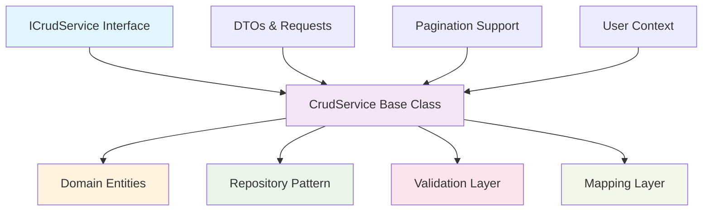
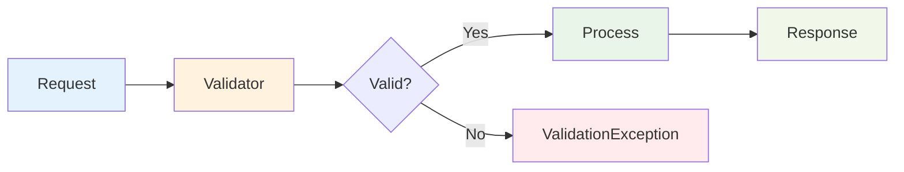

# Framework.Application

The Application layer implements business logic, orchestrates domain operations, and provides the foundation for building robust, maintainable business services with comprehensive CRUD operations, validation, and mapping.

## 🎯 Purpose

The Application layer serves as the orchestrator between your domain entities and external concerns:

- **Business logic implementation** with generic CRUD services
- **Input validation** using FluentValidation
- **Object mapping** with Mapster for DTO transformations
- **Pagination support** (both offset-based and cursor-based)
- **Authorization context** with user-aware operations

## 📦 Installation

```bash
dotnet add package MasLazu.AspNet.Framework.Application
```

## 🏗️ Core Components

### Architecture Overview



### ICrudService Interface

The core contract for business operations:

```csharp
public interface ICrudService<TDto, TCreateRequest, TUpdateRequest>
    where TDto : BaseDto
    where TUpdateRequest : BaseUpdateRequest
{
    // Read operations
    Task<TDto?> GetByIdAsync(Guid userId, Guid id, CancellationToken ct = default);
    Task<IEnumerable<TDto>> GetAllAsync(Guid userId, CancellationToken ct = default);
    Task<PaginatedResult<TDto>> GetPaginatedAsync(Guid userId, PaginationRequest request, CancellationToken ct = default);
    Task<CursorPaginatedResult<TDto>> GetCursorPaginatedAsync(Guid userId, CursorPaginationRequest request, CancellationToken ct = default);

    // Write operations
    Task<TDto> CreateAsync(Guid userId, TCreateRequest createRequest, CancellationToken ct = default);
    Task<IEnumerable<TDto>> CreateRangeAsync(Guid userId, IEnumerable<TCreateRequest> createRequests, CancellationToken ct = default);
    Task<TDto> UpdateAsync(Guid userId, Guid id, TUpdateRequest updateRequest, CancellationToken ct = default);
    Task DeleteAsync(Guid userId, Guid id, CancellationToken ct = default);
    Task DeleteRangeAsync(Guid userId, IEnumerable<Guid> ids, CancellationToken ct = default);

    // Utility operations
    Task<bool> ExistsAsync(Guid userId, Guid id, CancellationToken ct = default);
    Task<int> CountAsync(Guid userId, CancellationToken ct = default);
}
```

### CrudService Base Class

Generic implementation providing complete CRUD functionality:

```csharp
public abstract class CrudService<TEntity, TDto, TCreateRequest, TUpdateRequest>
    : ICrudService<TDto, TCreateRequest, TUpdateRequest>
    where TEntity : BaseEntity
    where TDto : BaseDto
    where TUpdateRequest : BaseUpdateRequest
{
    protected readonly IRepository<TEntity> Repository;
    protected readonly IReadRepository<TEntity> ReadRepository;
    protected readonly IUnitOfWork UnitOfWork;
    protected readonly IValidator<TCreateRequest>? CreateValidator;
    protected readonly IValidator<TUpdateRequest>? UpdateValidator;
    // ... additional dependencies
}
```

## 🚀 Usage Examples

### 1. Basic Service Implementation

```csharp
// Domain Entity
public class Product : BaseEntity
{
    public string Name { get; set; } = string.Empty;
    public string Description { get; set; } = string.Empty;
    public decimal Price { get; set; }
    public string Category { get; set; } = string.Empty;
}

// DTO
public class ProductDto : BaseDto
{
    public string Name { get; set; } = string.Empty;
    public string Description { get; set; } = string.Empty;
    public decimal Price { get; set; }
    public string Category { get; set; } = string.Empty;
}

// Request Models
public class CreateProductRequest
{
    public string Name { get; set; } = string.Empty;
    public string Description { get; set; } = string.Empty;
    public decimal Price { get; set; }
    public string Category { get; set; } = string.Empty;
}

public class UpdateProductRequest : BaseUpdateRequest
{
    public string? Name { get; set; }
    public string? Description { get; set; }
    public decimal? Price { get; set; }
    public string? Category { get; set; }
}

// Service Implementation
public class ProductService : CrudService<Product, ProductDto, CreateProductRequest, UpdateProductRequest>
{
    public ProductService(
        IRepository<Product> repository,
        IReadRepository<Product> readRepository,
        IUnitOfWork unitOfWork,
        IEntityPropertyMap<Product> propertyMap,
        IPaginationValidator<Product> paginationValidator,
        ICursorPaginationValidator<Product> cursorPaginationValidator,
        IValidator<CreateProductRequest>? createValidator = null,
        IValidator<UpdateProductRequest>? updateValidator = null)
        : base(repository, readRepository, unitOfWork, propertyMap,
               paginationValidator, cursorPaginationValidator,
               createValidator, updateValidator)
    {
    }

    // Override for custom business logic
    public override async Task<ProductDto> CreateAsync(Guid userId, CreateProductRequest createRequest, CancellationToken ct = default)
    {
        // Custom validation
        if (await Repository.AnyAsync(p => p.Name == createRequest.Name, ct))
            throw new BusinessException("Product name already exists");

        // Call base implementation
        return await base.CreateAsync(userId, createRequest, ct);
    }
}
```

### 2. Advanced Service with Custom Logic

```csharp
public class OrderService : CrudService<Order, OrderDto, CreateOrderRequest, UpdateOrderRequest>
{
    private readonly IProductService _productService;
    private readonly IInventoryService _inventoryService;
    private readonly IEmailService _emailService;

    public OrderService(
        IRepository<Order> repository,
        IReadRepository<Order> readRepository,
        IUnitOfWork unitOfWork,
        IEntityPropertyMap<Order> propertyMap,
        IPaginationValidator<Order> paginationValidator,
        ICursorPaginationValidator<Order> cursorPaginationValidator,
        IProductService productService,
        IInventoryService inventoryService,
        IEmailService emailService,
        IValidator<CreateOrderRequest>? createValidator = null,
        IValidator<UpdateOrderRequest>? updateValidator = null)
        : base(repository, readRepository, unitOfWork, propertyMap,
               paginationValidator, cursorPaginationValidator,
               createValidator, updateValidator)
    {
        _productService = productService;
        _inventoryService = inventoryService;
        _emailService = emailService;
    }

    public override async Task<OrderDto> CreateAsync(Guid userId, CreateOrderRequest createRequest, CancellationToken ct = default)
    {
        // Business logic before creation
        await ValidateInventoryAsync(createRequest.Items, ct);

        var order = await base.CreateAsync(userId, createRequest, ct);

        // Business logic after creation
        await ReserveInventoryAsync(createRequest.Items, ct);
        await SendOrderConfirmationAsync(order, ct);

        return order;
    }

    public async Task<OrderDto> ConfirmOrderAsync(Guid userId, Guid orderId, CancellationToken ct = default)
    {
        var order = await Repository.GetByIdAsync(orderId, ct);
        if (order == null)
            throw new NotFoundException("Order not found");

        if (order.Status != OrderStatus.Draft)
            throw new BusinessException("Only draft orders can be confirmed");

        order.Status = OrderStatus.Confirmed;
        order.ConfirmedAt = DateTime.UtcNow;

        await Repository.UpdateAsync(order, ct);
        await UnitOfWork.SaveChangesAsync(ct);

        // Send confirmation email
        await _emailService.SendOrderConfirmationAsync(order, ct);

        return order.Adapt<OrderDto>();
    }

    private async Task ValidateInventoryAsync(IEnumerable<OrderItemRequest> items, CancellationToken ct)
    {
        foreach (var item in items)
        {
            var available = await _inventoryService.GetAvailableQuantityAsync(item.ProductId, ct);
            if (available < item.Quantity)
                throw new BusinessException($"Insufficient inventory for product {item.ProductId}");
        }
    }
}
```

### 3. Validation Implementation

```csharp
public class CreateProductRequestValidator : AbstractValidator<CreateProductRequest>
{
    public CreateProductRequestValidator()
    {
        RuleFor(x => x.Name)
            .NotEmpty().WithMessage("Product name is required")
            .MaximumLength(100).WithMessage("Name cannot exceed 100 characters");

        RuleFor(x => x.Description)
            .NotEmpty().WithMessage("Description is required")
            .MaximumLength(1000).WithMessage("Description cannot exceed 1000 characters");

        RuleFor(x => x.Price)
            .GreaterThan(0).WithMessage("Price must be greater than 0")
            .LessThan(1000000).WithMessage("Price cannot exceed 1,000,000");

        RuleFor(x => x.Category)
            .NotEmpty().WithMessage("Category is required")
            .Must(BeValidCategory).WithMessage("Invalid category");
    }

    private bool BeValidCategory(string category)
    {
        var validCategories = new[] { "Electronics", "Clothing", "Books", "Home" };
        return validCategories.Contains(category);
    }
}
```

### 4. Pagination Usage

```csharp
public class ProductController : ControllerBase
{
    private readonly IProductService _productService;

    [HttpGet]
    public async Task<ActionResult<PaginatedResult<ProductDto>>> GetProducts(
        [FromQuery] PaginationRequest request,
        CancellationToken ct)
    {
        var userId = GetCurrentUserId();
        var result = await _productService.GetPaginatedAsync(userId, request, ct);
        return Ok(result);
    }

    [HttpGet("cursor")]
    public async Task<ActionResult<CursorPaginatedResult<ProductDto>>> GetProductsCursor(
        [FromQuery] CursorPaginationRequest request,
        CancellationToken ct)
    {
        var userId = GetCurrentUserId();
        var result = await _productService.GetCursorPaginatedAsync(userId, request, ct);
        return Ok(result);
    }
}
```

## 🎯 Key Features

### 1. **Built-in Validation**



### 2. **Dual Pagination Support**

```csharp
// Offset-based pagination (traditional)
var request = new PaginationRequest
{
    Page = 1,
    PageSize = 20,
    OrderBy = "Name",
    OrderDirection = "asc",
    Filters = new[]
    {
        new FilterRequest { Field = "Category", Operator = "eq", Value = "Electronics" }
    }
};

// Cursor-based pagination (performance optimized)
var cursorRequest = new CursorPaginationRequest
{
    Limit = 20,
    Cursor = "eyJpZCI6IjEyMyJ9", // Base64 encoded cursor
    OrderBy = "CreatedAt",
    OrderDirection = "desc"
};
```

### 3. **Property Mapping & Validation**

```csharp
public class ProductPropertyMap : IEntityPropertyMap<Product>
{
    public IDictionary<string, Expression<Func<Product, object>>> PropertyMappings =>
        new Dictionary<string, Expression<Func<Product, object>>>
        {
            ["name"] = p => p.Name,
            ["description"] = p => p.Description,
            ["price"] = p => p.Price,
            ["category"] = p => p.Category,
            ["createdAt"] = p => p.CreatedAt,
            ["updatedAt"] = p => p.UpdatedAt ?? DateTime.MinValue
        };

    public IDictionary<string, Type> PropertyTypes =>
        new Dictionary<string, Type>
        {
            ["name"] = typeof(string),
            ["description"] = typeof(string),
            ["price"] = typeof(decimal),
            ["category"] = typeof(string),
            ["createdAt"] = typeof(DateTime),
            ["updatedAt"] = typeof(DateTime)
        };
}
```

## 📁 Project Structure

```
MasLazu.AspNet.Framework.Application/
├── Interfaces/
│   ├── ICrudService.cs            # Main service contract
│   ├── IRepository.cs             # Write repository interface
│   ├── IReadRepository.cs         # Read repository interface
│   ├── IUnitOfWork.cs            # Transaction management
│   ├── IPaginationValidator.cs    # Pagination validation
│   └── IEntityPropertyMap.cs     # Property mapping contract
├── Services/
│   └── CrudService.cs            # Generic CRUD implementation
├── Models/
│   ├── BaseDto.cs                # Base DTO class
│   ├── BaseUpdateRequest.cs      # Base update request
│   ├── PaginationRequest.cs      # Offset pagination
│   ├── PaginatedResult.cs        # Offset pagination result
│   ├── CursorPaginationRequest.cs # Cursor pagination
│   └── CursorPaginatedResult.cs  # Cursor pagination result
├── Validators/
│   ├── PaginationValidator.cs    # Pagination validation logic
│   └── CursorPaginationValidator.cs # Cursor validation logic
├── Exceptions/
│   ├── BusinessException.cs      # Business logic exceptions
│   └── ValidationException.cs    # Validation exceptions
├── Extensions/
│   └── FrameworkApplicationExtension.cs # DI registration
└── Utils/
    └── PaginationUtils.cs        # Pagination utilities
```

## 🔗 Dependencies

```xml
<PackageReference Include="MasLazu.AspNet.Framework.Domain" />
<PackageReference Include="FluentValidation" />
<PackageReference Include="Mapster" />
<PackageReference Include="Microsoft.Extensions.DependencyInjection" />
<PackageReference Include="FastEndpoints" />
```

## ⚙️ Registration

```csharp
// Startup.cs or Program.cs
services.AddFrameworkApplication();

// Register your services
services.AddScoped<IProductService, ProductService>();
services.AddScoped<IOrderService, OrderService>();

// Register validators
services.AddValidatorsFromAssemblyContaining<CreateProductRequestValidator>();

// Register property maps
services.AddScoped<IEntityPropertyMap<Product>, ProductPropertyMap>();
```

## ✅ Best Practices

### ✅ Do's

- **Inherit from CrudService** for consistent functionality
- **Implement validation** using FluentValidation
- **Use property maps** for dynamic field access
- **Handle user context** for authorization and auditing
- **Override methods** for custom business logic
- **Use cancellation tokens** for responsive applications

### ❌ Don'ts

- **Don't bypass validation** in service methods
- **Don't ignore user context** for authorization
- **Don't forget error handling** for business operations
- **Don't implement data access** directly in services
- **Don't use primitive types** for complex operations

## 🎯 Next Steps

After implementing your application services:

1. **[Framework.EfCore](./efcore.md)** - Add repository implementations
2. **[Framework.Endpoint](./endpoint.md)** - Create API endpoints
3. **[Modules Overview](../modules/overview.md)** - Explore pre-built modules

## 📚 Related Documentation

- [Framework.Domain](./domain.md) - Domain entities and business logic
- [Architecture Overview](../intro.md#architecture-overview)
- [Getting Started Guide](../getting-started/installation.md)
