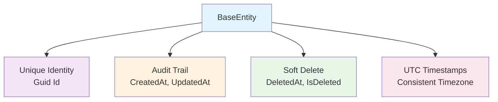

# Framework.Domain

The Domain layer forms the core foundation of MasLazu.AspNet Framework, containing essential domain entities and business logic building blocks that define the fundamental structure of your application.

## 🎯 Purpose

The Domain layer implements Domain-Driven Design (DDD) principles, providing:

- **Base entities** with built-in audit trails and soft delete functionality
- **Domain contracts** and interfaces for business rules
- **Value objects** and domain services
- **Foundation** for the entire framework ecosystem

## 📦 Installation

```bash
dotnet add package MasLazu.AspNet.Framework.Domain
```

## 🏗️ Core Components

### BaseEntity

The fundamental building block for all domain entities in the framework:

```csharp
public abstract class BaseEntity
{
    public Guid Id { get; set; } = Guid.NewGuid();
    public DateTime CreatedAt { get; set; } = DateTime.UtcNow;
    public DateTime? UpdatedAt { get; set; }
    public DateTime? DeletedAt { get; set; }

    // Soft delete functionality
    public bool IsDeleted => DeletedAt.HasValue;
}
```

### Key Features



## 🚀 Usage Examples

### Creating Domain Entities

```csharp
using MasLazu.AspNet.Framework.Domain.Entities;

public class Product : BaseEntity
{
    public string Name { get; set; } = string.Empty;
    public string Description { get; set; } = string.Empty;
    public decimal Price { get; set; }
    public string Category { get; set; } = string.Empty;

    // Domain methods
    public void UpdatePrice(decimal newPrice)
    {
        if (newPrice <= 0)
            throw new ArgumentException("Price must be positive");

        Price = newPrice;
        UpdatedAt = DateTime.UtcNow;
    }

    public void Discontinue()
    {
        DeletedAt = DateTime.UtcNow;
    }
}
```

### Rich Domain Models

```csharp
public class Order : BaseEntity
{
    public string OrderNumber { get; set; } = string.Empty;
    public Guid CustomerId { get; set; }
    public OrderStatus Status { get; set; }
    public decimal TotalAmount { get; set; }

    // Navigation properties
    public Customer Customer { get; set; } = null!;
    public List<OrderItem> Items { get; set; } = new();

    // Business logic
    public void AddItem(Product product, int quantity)
    {
        if (Status != OrderStatus.Draft)
            throw new InvalidOperationException("Cannot modify confirmed order");

        var existingItem = Items.FirstOrDefault(i => i.ProductId == product.Id);
        if (existingItem != null)
        {
            existingItem.UpdateQuantity(existingItem.Quantity + quantity);
        }
        else
        {
            Items.Add(new OrderItem(product.Id, quantity, product.Price));
        }

        RecalculateTotal();
    }

    private void RecalculateTotal()
    {
        TotalAmount = Items.Sum(i => i.Subtotal);
        UpdatedAt = DateTime.UtcNow;
    }
}

public enum OrderStatus
{
    Draft,
    Confirmed,
    Shipped,
    Delivered,
    Cancelled
}
```

### Value Objects

```csharp
public record Money(decimal Amount, string Currency)
{
    public static Money Zero(string currency) => new(0, currency);

    public Money Add(Money other)
    {
        if (Currency != other.Currency)
            throw new InvalidOperationException("Cannot add different currencies");

        return new Money(Amount + other.Amount, Currency);
    }
}

public record Address(
    string Street,
    string City,
    string State,
    string PostalCode,
    string Country)
{
    public string FullAddress => $"{Street}, {City}, {State} {PostalCode}, {Country}";
}
```

## 🎯 Design Principles

### 1. **Domain Integrity**

```csharp
public class Account : BaseEntity
{
    private decimal _balance;

    public decimal Balance => _balance;

    public void Deposit(decimal amount)
    {
        if (amount <= 0)
            throw new ArgumentException("Deposit amount must be positive");

        _balance += amount;
        UpdatedAt = DateTime.UtcNow;
    }

    public void Withdraw(decimal amount)
    {
        if (amount <= 0)
            throw new ArgumentException("Withdrawal amount must be positive");
        if (amount > _balance)
            throw new InvalidOperationException("Insufficient funds");

        _balance -= amount;
        UpdatedAt = DateTime.UtcNow;
    }
}
```

### 2. **Aggregate Roots**

```csharp
public class BlogPost : BaseEntity // Aggregate Root
{
    public string Title { get; set; } = string.Empty;
    public string Content { get; set; } = string.Empty;
    public Guid AuthorId { get; set; }
    public BlogPostStatus Status { get; set; }

    // Aggregate members
    public List<Comment> Comments { get; set; } = new();
    public List<Tag> Tags { get; set; } = new();

    // Aggregate operations
    public void Publish()
    {
        if (string.IsNullOrWhiteSpace(Title) || string.IsNullOrWhiteSpace(Content))
            throw new InvalidOperationException("Title and content are required");

        Status = BlogPostStatus.Published;
        UpdatedAt = DateTime.UtcNow;
    }

    public void AddComment(string author, string content)
    {
        if (Status != BlogPostStatus.Published)
            throw new InvalidOperationException("Cannot comment on unpublished post");

        Comments.Add(new Comment(author, content));
        UpdatedAt = DateTime.UtcNow;
    }
}
```

### 3. **Domain Events**

```csharp
public abstract class DomainEvent
{
    public DateTime OccurredAt { get; } = DateTime.UtcNow;
    public Guid EventId { get; } = Guid.NewGuid();
}

public class ProductCreatedEvent : DomainEvent
{
    public Guid ProductId { get; set; }
    public string ProductName { get; set; } = string.Empty;
}

public class Product : BaseEntity
{
    private readonly List<DomainEvent> _domainEvents = new();
    public IReadOnlyList<DomainEvent> DomainEvents => _domainEvents.AsReadOnly();

    public string Name { get; set; } = string.Empty;

    public static Product Create(string name)
    {
        var product = new Product { Name = name };
        product._domainEvents.Add(new ProductCreatedEvent
        {
            ProductId = product.Id,
            ProductName = name
        });
        return product;
    }

    public void ClearDomainEvents() => _domainEvents.Clear();
}
```

## 📁 Project Structure

```
MasLazu.AspNet.Framework.Domain/
├── Entities/
│   └── BaseEntity.cs              # Base entity with audit and soft delete
├── Events/                        # Domain events (optional)
├── ValueObjects/                  # Value objects and immutable types
├── Interfaces/                    # Domain service contracts
└── MasLazu.AspNet.Framework.Domain.csproj
```

## 🔗 Dependencies

- **No external dependencies** - Pure domain layer
- Only depends on .NET base class library
- Framework-agnostic design

## ✅ Best Practices

### ✅ Do's

- **Inherit from BaseEntity** for all domain entities
- **Implement business logic** within domain entities
- **Use value objects** for complex types without identity
- **Keep domain pure** - no infrastructure dependencies
- **Use UTC timestamps** for consistency across timezones

### ❌ Don'ts

- **Don't reference infrastructure** libraries from domain
- **Don't implement data access** in domain entities
- **Don't use primitive obsession** - create value objects
- **Don't expose setters** for critical business properties
- **Don't forget to set UpdatedAt** when modifying entities

## 🎯 Next Steps

After implementing your domain entities:

1. **[Framework.Application](./application.md)** - Implement business logic and services
2. **[Framework.EfCore](./efcore.md)** - Add database persistence
3. **[Framework.Endpoint](./endpoint.md)** - Create API endpoints

## 📚 Related Documentation

- [Architecture Overview](../intro.md#architecture-overview)
- [Framework Overview](./overview.md)
- [Getting Started Guide](../getting-started/installation.md)
