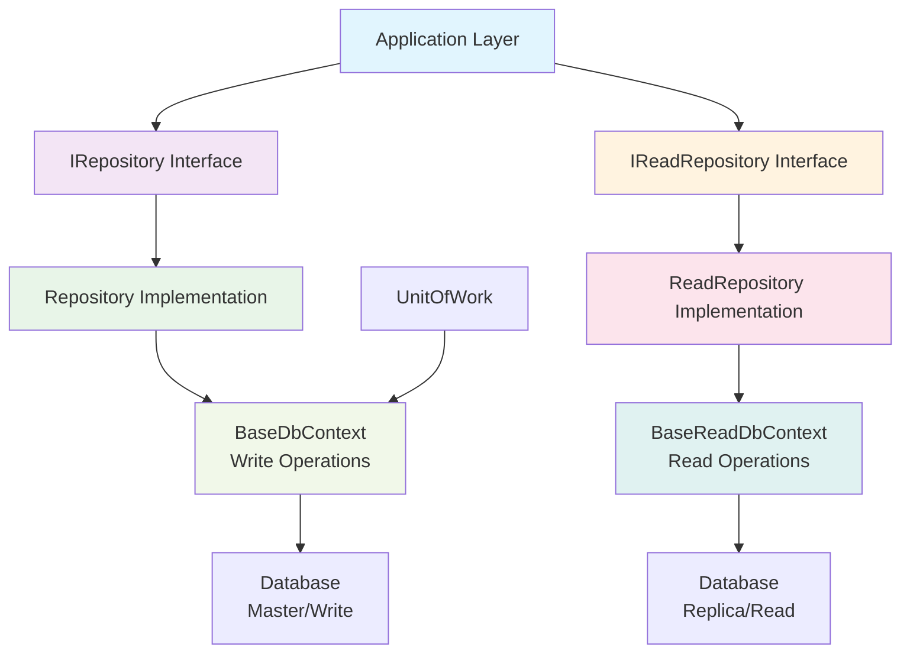
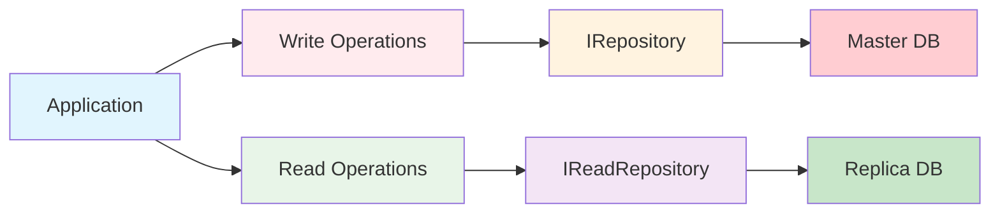

# Framework.EfCore

The EfCore layer provides robust Entity Framework Core implementations of the repository pattern with read/write separation, advanced querying capabilities, and optimized database operations for high-performance applications.

## 🎯 Purpose

The EfCore layer bridges your application services with the database:

- **Repository pattern implementation** with read/write separation
- **Advanced querying** with filtering, sorting, and pagination
- **Transaction management** through Unit of Work pattern
- **Performance optimization** with read-only contexts
- **Database-agnostic design** supporting multiple providers

## 📦 Installation

```bash
dotnet add package MasLazu.AspNet.Framework.EfCore
```

## 🏗️ Core Components

### Architecture Overview



### Repository Implementation

```csharp
public class Repository<T, TContext> : IRepository<T>
    where T : BaseEntity
    where TContext : BaseDbContext
{
    protected readonly TContext Context;
    protected readonly DbSet<T> DbSet;

    public Repository(TContext context)
    {
        Context = context;
        DbSet = context.Set<T>();
    }

    public async Task<T> AddAsync(T entity, CancellationToken ct = default)
    {
        var entry = await DbSet.AddAsync(entity, ct);
        return entry.Entity;
    }

    public async Task<T?> GetByIdAsync(Guid id, CancellationToken ct = default)
    {
        return await DbSet
            .Where(e => e.DeletedAt == null)
            .FirstOrDefaultAsync(e => e.Id == id, ct);
    }

    // ... additional methods
}
```

### ReadRepository Implementation

```csharp
public class ReadRepository<T, TContext> : IReadRepository<T>
    where T : BaseEntity
    where TContext : BaseReadDbContext
{
    protected readonly TContext Context;
    protected readonly DbSet<T> DbSet;

    public ReadRepository(TContext context)
    {
        Context = context;
        DbSet = context.Set<T>();
    }

    public async Task<PaginatedResult<T>> GetPaginatedAsync(
        PaginationRequest request,
        CancellationToken ct = default)
    {
        var query = DbSet.Where(e => e.DeletedAt == null);

        // Apply filters
        query = ApplyFilters(query, request.Filters);

        // Apply sorting
        query = ApplySorting(query, request.OrderBy, request.OrderDirection);

        var totalCount = await query.CountAsync(ct);
        var items = await query
            .Skip((request.Page - 1) * request.PageSize)
            .Take(request.PageSize)
            .ToListAsync(ct);

        return new PaginatedResult<T>
        {
            Items = items,
            TotalCount = totalCount,
            Page = request.Page,
            PageSize = request.PageSize,
            TotalPages = (int)Math.Ceiling(totalCount / (double)request.PageSize)
        };
    }
}
```

## 🚀 Usage Examples

### 1. Basic DbContext Setup

```csharp
// Write Context
public class ApplicationDbContext : BaseDbContext
{
    public ApplicationDbContext(DbContextOptions<ApplicationDbContext> options)
        : base(options)
    {
    }

    public DbSet<Product> Products { get; set; } = null!;
    public DbSet<Order> Orders { get; set; } = null!;
    public DbSet<Customer> Customers { get; set; } = null!;

    protected override void OnModelCreating(ModelBuilder modelBuilder)
    {
        base.OnModelCreating(modelBuilder);

        // Apply configurations
        modelBuilder.ApplyConfigurationsFromAssembly(typeof(ApplicationDbContext).Assembly);

        // Global query filters for soft delete
        foreach (var entityType in modelBuilder.Model.GetEntityTypes())
        {
            if (typeof(BaseEntity).IsAssignableFrom(entityType.ClrType))
            {
                var parameter = Expression.Parameter(entityType.ClrType, "e");
                var property = Expression.Property(parameter, nameof(BaseEntity.DeletedAt));
                var condition = Expression.Equal(property, Expression.Constant(null));
                var lambda = Expression.Lambda(condition, parameter);

                modelBuilder.Entity(entityType.ClrType).HasQueryFilter(lambda);
            }
        }
    }
}

// Read Context (Optional - for read/write separation)
public class ApplicationReadDbContext : BaseReadDbContext
{
    public ApplicationReadDbContext(DbContextOptions<ApplicationReadDbContext> options)
        : base(options)
    {
    }

    public DbSet<Product> Products { get; set; } = null!;
    public DbSet<Order> Orders { get; set; } = null!;
    public DbSet<Customer> Customers { get; set; } = null!;
}
```

### 2. Entity Configurations

```csharp
public class ProductConfiguration : IEntityTypeConfiguration<Product>
{
    public void Configure(EntityTypeBuilder<Product> builder)
    {
        builder.ToTable("Products");

        builder.HasKey(p => p.Id);

        builder.Property(p => p.Name)
            .HasMaxLength(100)
            .IsRequired();

        builder.Property(p => p.Description)
            .HasMaxLength(1000);

        builder.Property(p => p.Price)
            .HasPrecision(18, 2);

        builder.Property(p => p.Category)
            .HasMaxLength(50)
            .IsRequired();

        // Indexes
        builder.HasIndex(p => p.Name)
            .IsUnique()
            .HasFilter("[DeletedAt] IS NULL");

        builder.HasIndex(p => p.Category);
        builder.HasIndex(p => p.CreatedAt);

        // Audit fields
        builder.Property(p => p.CreatedAt)
            .HasDefaultValueSql("GETUTCDATE()");
    }
}

public class OrderConfiguration : IEntityTypeConfiguration<Order>
{
    public void Configure(EntityTypeBuilder<Order> builder)
    {
        builder.ToTable("Orders");

        builder.HasKey(o => o.Id);

        builder.Property(o => o.OrderNumber)
            .HasMaxLength(20)
            .IsRequired();

        builder.Property(o => o.TotalAmount)
            .HasPrecision(18, 2);

        // Relationships
        builder.HasOne(o => o.Customer)
            .WithMany(c => c.Orders)
            .HasForeignKey(o => o.CustomerId)
            .OnDelete(DeleteBehavior.Restrict);

        builder.HasMany(o => o.Items)
            .WithOne(i => i.Order)
            .HasForeignKey(i => i.OrderId)
            .OnDelete(DeleteBehavior.Cascade);

        // Indexes
        builder.HasIndex(o => o.OrderNumber)
            .IsUnique();

        builder.HasIndex(o => o.CustomerId);
        builder.HasIndex(o => o.Status);
        builder.HasIndex(o => o.CreatedAt);
    }
}
```

### 3. Service Registration

```csharp
// Program.cs or Startup.cs
public void ConfigureServices(IServiceCollection services)
{
    // Database contexts
    services.AddDbContext<ApplicationDbContext>(options =>
        options.UseNpgsql(connectionString));

    // Optional: Read context for read/write separation
    services.AddDbContext<ApplicationReadDbContext>(options =>
        options.UseNpgsql(readOnlyConnectionString));

    // Framework registration
    services.AddFrameworkEfCore();

    // Auto-register repositories for all entities
    services.AddRepositoriesForAllEntities<ApplicationDbContext>();

    // Or register specific repositories
    services.AddRepository<Product, ApplicationDbContext>();
    services.AddRepository<Order, ApplicationDbContext>();

    // Unit of Work
    services.AddScoped<IUnitOfWork, UnitOfWork<ApplicationDbContext>>();
}
```

### 4. Advanced Querying

```csharp
public class ProductService : CrudService<Product, ProductDto, CreateProductRequest, UpdateProductRequest>
{
    public async Task<IEnumerable<ProductDto>> GetProductsByCategoryAsync(
        Guid userId,
        string category,
        CancellationToken ct = default)
    {
        var products = await ReadRepository.GetManyAsync(
            p => p.Category == category && p.Price > 0,
            ct);

        return products.Adapt<IEnumerable<ProductDto>>();
    }

    public async Task<PaginatedResult<ProductDto>> SearchProductsAsync(
        Guid userId,
        string searchTerm,
        PaginationRequest pagination,
        CancellationToken ct = default)
    {
        var request = pagination with
        {
            Filters = pagination.Filters.Concat(new[]
            {
                new FilterRequest
                {
                    Field = "Name",
                    Operator = "contains",
                    Value = searchTerm
                }
            }).ToArray()
        };

        return await GetPaginatedAsync(userId, request, ct);
    }
}
```

### 5. Unit of Work Pattern

```csharp
public class OrderService : CrudService<Order, OrderDto, CreateOrderRequest, UpdateOrderRequest>
{
    private readonly IRepository<Product> _productRepository;
    private readonly IRepository<Inventory> _inventoryRepository;

    public async Task<OrderDto> CreateOrderWithInventoryUpdateAsync(
        Guid userId,
        CreateOrderRequest request,
        CancellationToken ct = default)
    {
        // Start transaction
        using var transaction = await UnitOfWork.BeginTransactionAsync(ct);

        try
        {
            // Create order
            var order = await CreateAsync(userId, request, ct);

            // Update inventory for each item
            foreach (var item in request.Items)
            {
                var inventory = await _inventoryRepository.GetFirstAsync(
                    i => i.ProductId == item.ProductId, ct);

                if (inventory == null || inventory.Quantity < item.Quantity)
                    throw new BusinessException($"Insufficient inventory for product {item.ProductId}");

                inventory.Quantity -= item.Quantity;
                await _inventoryRepository.UpdateAsync(inventory, ct);
            }

            // Save all changes
            await UnitOfWork.SaveChangesAsync(ct);
            await transaction.CommitAsync(ct);

            return order;
        }
        catch
        {
            await transaction.RollbackAsync(ct);
            throw;
        }
    }
}
```

## 🎯 Key Features

### 1. **Read/Write Separation**



### 2. **Advanced Filtering**

```csharp
// Supported filter operators
var filters = new[]
{
    new FilterRequest { Field = "Name", Operator = "eq", Value = "Product A" },
    new FilterRequest { Field = "Price", Operator = "gte", Value = "100" },
    new FilterRequest { Field = "Category", Operator = "in", Value = "Electronics,Books" },
    new FilterRequest { Field = "Description", Operator = "contains", Value = "premium" },
    new FilterRequest { Field = "CreatedAt", Operator = "between", Value = "2024-01-01,2024-12-31" }
};
```

### 3. **Cursor Pagination**

```csharp
public async Task<CursorPaginatedResult<ProductDto>> GetProductsCursorAsync(
    Guid userId,
    CursorPaginationRequest request,
    CancellationToken ct = default)
{
    // High-performance pagination for large datasets
    return await GetCursorPaginatedAsync(userId, request, ct);
}
```

### 4. **Soft Delete Support**

```csharp
// Automatic soft delete filtering
public async Task DeleteAsync(Guid userId, Guid id, CancellationToken ct = default)
{
    var entity = await Repository.GetByIdAsync(id, ct);
    if (entity == null)
        throw new NotFoundException();

    entity.DeletedAt = DateTime.UtcNow;
    await Repository.UpdateAsync(entity, ct);
    await UnitOfWork.SaveChangesAsync(ct);
}

// Include deleted entities when needed
public async Task<IEnumerable<ProductDto>> GetAllIncludingDeletedAsync(
    Guid userId,
    CancellationToken ct = default)
{
    var products = await ReadRepository.GetManyAsync(
        p => true, // No filter - includes deleted
        includeDeleted: true,
        ct);

    return products.Adapt<IEnumerable<ProductDto>>();
}
```

## 📁 Project Structure

```
MasLazu.AspNet.Framework.EfCore/
├── Data/
│   ├── BaseDbContext.cs          # Base write context
│   ├── BaseReadDbContext.cs      # Base read context
│   └── UnitOfWork.cs            # Transaction management
├── Repositories/
│   ├── Repository.cs            # Write repository implementation
│   └── ReadRepository.cs        # Read repository implementation
├── Services/
│   └── DatabaseService.cs       # Database utilities
├── Extensions/
│   └── EntityFrameworkCoreRepositoryExtensions.cs # DI registration
├── Configurations/
│   └── BaseEntityConfiguration.cs # Base entity configuration
└── MasLazu.AspNet.Framework.EfCore.csproj
```

## 🔗 Dependencies

```xml
<PackageReference Include="MasLazu.AspNet.Framework.Application" />
<PackageReference Include="Microsoft.EntityFrameworkCore" />
<PackageReference Include="Microsoft.EntityFrameworkCore.Relational" />
<PackageReference Include="Mapster" />
```

## ⚙️ Database Providers

The framework supports multiple database providers through additional packages:

### PostgreSQL (Recommended)

```bash
dotnet add package MasLazu.AspNet.Framework.EfCore.Postgresql
```

### SQL Server

```bash
dotnet add package Microsoft.EntityFrameworkCore.SqlServer
```

### SQLite (Development)

```bash
dotnet add package Microsoft.EntityFrameworkCore.Sqlite
```

### MySQL

```bash
dotnet add package Pomelo.EntityFrameworkCore.MySql
```

## ✅ Best Practices

### ✅ Do's

- **Use entity configurations** for complex mappings
- **Implement global query filters** for soft delete
- **Create proper indexes** for performance
- **Use read/write separation** for scalability
- **Handle transactions** with Unit of Work
- **Use cancellation tokens** for responsive operations

### ❌ Don'ts

- **Don't use raw SQL** unless absolutely necessary
- **Don't ignore performance implications** of queries
- **Don't forget to handle concurrency** conflicts
- **Don't expose DbContext** outside the repository layer
- **Don't perform complex logic** in entity configurations

## 🎯 Performance Tips

### 1. **Efficient Querying**

```csharp
// Good: Use projection to limit data transfer
var products = await ReadRepository.GetManyAsync(
    p => p.Category == "Electronics",
    p => new ProductSummaryDto { Id = p.Id, Name = p.Name, Price = p.Price },
    ct);

// Avoid: Loading full entities when only partial data is needed
var products = await ReadRepository.GetManyAsync(
    p => p.Category == "Electronics", ct);
```

### 2. **Proper Indexing**

```csharp
// Create composite indexes for common query patterns
builder.HasIndex(p => new { p.Category, p.Price });
builder.HasIndex(p => new { p.CreatedAt, p.DeletedAt });
```

### 3. **Cursor Pagination for Large Datasets**

```csharp
// Use cursor pagination for better performance with large datasets
var request = new CursorPaginationRequest
{
    Limit = 100,
    OrderBy = "CreatedAt",
    OrderDirection = "desc"
};
```

## 🎯 Next Steps

After setting up your EfCore layer:

1. **[Framework.EfCore.Postgresql](./postgresql.md)** - PostgreSQL-specific features
2. **[Framework.Endpoint](./endpoint.md)** - Create API endpoints
3. **[Performance Optimization](../examples/performance.md)** - Advanced optimization techniques

## 📚 Related Documentation

- [Framework.Application](./application.md) - Business logic layer
- [Framework.Domain](./domain.md) - Domain entities
- [Architecture Overview](../intro.md#architecture-overview)
