# Framework Overview

The MasLazu.AspNet Framework provides the foundational libraries for building modern ASP.NET Core applications with clean architecture principles.

## Architecture

The MasLazu.AspNet Framework implements **Ports and Adapters (Hexagonal Architecture)**, a proven pattern for building maintainable, testable, and flexible applications. This architecture provides exceptional adaptability and follows the principle of dependency inversion.

### Architecture Layers

The framework follows this dependency flow pattern:

```mermaid
graph TD
    A[Abstraction Layer<br/>Ports - Contracts & Interfaces<br/>• IRepository, ICrudService<br/>• Request/Response DTOs<br/>• Domain Contracts] --> B[Data Layer<br/>Domain Models & Entities<br/>• BaseEntity, Domain Objects<br/>• Business Rules & Logic<br/>• Domain Services]

    B --> C[Application Layer<br/>Use Cases & Orchestration<br/>• CrudService, Business Logic<br/>• Validation & Mapping<br/>• Application Services]

    C --> D[Infrastructure Layer<br/>Adapters - External Concerns<br/>• EfCore, Database Providers<br/>• External Services<br/>• Framework Integrations]

    style A fill:#e1f5fe
    style B fill:#f3e5f5
    style C fill:#fff3e0
    style D fill:#e8f5e8
```



### Infrastructure Flexibility

The architecture supports multiple infrastructure implementations:

#### **Database Adapters**


#### **Presentation Adapters**


### Deployment Patterns

#### **Modular Monolith (Direct Usage)**


#### **Distributed Services (RPC)**


**Supported RPC Protocols:**

- **REST** - HTTP/JSON APIs
- **gRPC** - High-performance binary protocol
- **Messaging** - Async communication (RabbitMQ, Azure Service Bus)
- **Unix Sockets** - High-speed local communication

### Implementation Variants

Create specialized implementations without breaking client compatibility:


### Key Architectural Benefits

- **🔄 Technology Independence** - Core business logic isolated from technical concerns
- **🧪 Superior Testability** - Mock abstractions for fast, reliable unit tests
- **📦 Clear Boundaries** - Each layer has a single responsibility
- **🚀 Deployment Agnostic** - Same code runs as monolith or microservices
- **🔧 Open for Extension** - Add features through composition and decoration
- **⚡ Performance Optimized** - Minimal abstractions, maximum flexibility

## Core Packages

### 🔷 MasLazu.AspNet.Framework.Domain

**Purpose**: Contains domain entities and core business logic

**Key Features:**

- `BaseEntity` with common properties (Id, CreatedAt, UpdatedAt, DeletedAt)
- GUID Version 7 for distributed ID generation
- Soft delete support with `DeletedAt` timestamp
- No external dependencies

**Example:**

```csharp
public class Product : BaseEntity
{
    public string Name { get; set; } = string.Empty;
    public decimal Price { get; set; }
    public bool IsActive { get; set; } = true;
}
```

### 🔷 MasLazu.AspNet.Framework.Application

**Purpose**: Business logic, services, and application orchestration

**Key Features:**

- Generic CRUD operations with `ICrudService<T>`
- Advanced pagination (offset-based and cursor-based)
- Property mapping and validation for dynamic queries
- Repository patterns with read/write separation
- Request/response DTOs with `BaseDto`

**Key Interfaces:**

- `ICrudService<TEntity, TDto>` - Generic CRUD operations
- `IRepository<T>` - Write operations
- `IReadRepository<T>` - Read-only operations
- `IPaginationValidator` - Pagination validation
- `IEntityPropertyMap` - Dynamic property mapping

### 🔷 MasLazu.AspNet.Framework.EfCore

**Purpose**: Entity Framework Core infrastructure implementation

**Key Features:**

- `BaseDbContext` with soft delete filtering
- Repository implementations with dependency injection
- Entity configurations and mappings
- Transaction management and Unit of Work pattern

**Key Classes:**

- `BaseDbContext` - Base database context
- `Repository<T>` - Generic repository implementation
- `ReadRepository<T>` - Read-only repository implementation

### 🔷 MasLazu.AspNet.Framework.EfCore.Postgresql

**Purpose**: PostgreSQL-specific implementations and extensions

**Key Features:**

- PostgreSQL connection and configuration
- Database provider registration
- PostgreSQL-specific optimizations

### 🔷 MasLazu.AspNet.Framework.Endpoint

**Purpose**: FastEndpoints integration for high-performance APIs

**Key Features:**

- `BaseEndpoint` classes for consistent API structure
- Automatic OpenAPI/Swagger documentation
- Versioned endpoints with `V1EndpointGroup`
- Request validation and response formatting
- Error handling and success responses

## Key Features

### 🚀 FastEndpoints Integration

High-performance minimal APIs with automatic documentation:

```csharp
public class GetProductEndpoint : BaseEndpoint<GetProductRequest, ProductDto>
{
    public override void Configure()
    {
        Get("/products/{id}");
        Group<V1EndpointGroup>();
    }

    public override async Task HandleAsync(GetProductRequest req, CancellationToken ct)
    {
        var product = await productService.GetByIdAsync(req.Id, ct);
        await SendOkAsync(product, ct);
    }
}
```

### 📄 Advanced Pagination

Both offset-based and cursor-based pagination with validation:

```csharp
// Offset-based pagination
public record PaginationRequest(
    int Page = 1,
    int PageSize = 10,
    string? OrderBy = null,
    bool OrderAscending = true
);

// Cursor-based pagination
public record CursorPaginationRequest(
    string? Cursor = null,
    int Limit = 10,
    string? OrderBy = null,
    bool OrderAscending = true
);
```

### 🔍 Generic CRUD Operations

Reusable CRUD operations with built-in validation:

```csharp
public interface ICrudService<TEntity, TDto>
    where TEntity : BaseEntity
    where TDto : BaseDto
{
    Task<TDto?> GetByIdAsync(Guid id, CancellationToken ct = default);
    Task<PaginatedResult<TDto>> GetPagedAsync(PaginationRequest request, CancellationToken ct = default);
    Task<TDto> CreateAsync(TDto dto, CancellationToken ct = default);
    Task<TDto> UpdateAsync(Guid id, TDto dto, CancellationToken ct = default);
    Task DeleteAsync(Guid id, CancellationToken ct = default);
}
```

### 🛡️ Advanced Validation

FluentValidation with field existence validation and operator compatibility:

```csharp
public class PaginationRequestValidator : AbstractValidator<PaginationRequest>
{
    public PaginationRequestValidator(IEntityPropertyMap propertyMap)
    {
        RuleFor(x => x.Page).GreaterThan(0);
        RuleFor(x => x.PageSize).InclusiveBetween(1, 100);
        RuleFor(x => x.OrderBy)
            .Must(propertyMap.IsValidProperty)
            .When(x => !string.IsNullOrEmpty(x.OrderBy))
            .WithMessage("Invalid order by field");
    }
}
```

### 🗄️ Soft Delete Support

Automatic soft deletion with audit trails:

```csharp
// BaseEntity includes DeletedAt property
public abstract class BaseEntity
{
    public Guid Id { get; set; } = Guid.CreateVersion7();
    public DateTimeOffset CreatedAt { get; set; } = DateTimeOffset.UtcNow;
    public DateTimeOffset? UpdatedAt { get; set; }
    public DateTimeOffset? DeletedAt { get; set; } // Soft delete timestamp
}

// Automatic filtering in BaseDbContext
modelBuilder.Entity<TEntity>()
    .HasQueryFilter(e => e.DeletedAt == null);
```

## Getting Started

1. **[Installation](../getting-started/installation.md)** - Set up the framework
2. **[Create Your First API](../getting-started/first-api.md)** - Build a complete CRUD API
3. **[Domain Layer](./domain-layer.md)** - Define your business entities
4. **[Application Layer](./application-layer.md)** - Implement business logic
5. **[Infrastructure Layer](./infrastructure-layer.md)** - Configure data access
6. **[Presentation Layer](./presentation-layer.md)** - Create API endpoints

## Examples

- [Simple CRUD API](../examples/simple-crud.md)
- [Advanced Filtering](../examples/advanced-filtering.md)
- [Custom Validation](../examples/custom-validation.md)
- [Repository Patterns](../examples/repository-patterns.md)
