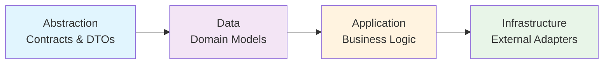
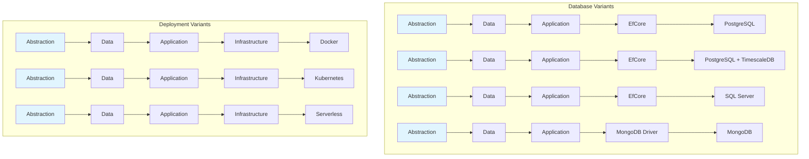
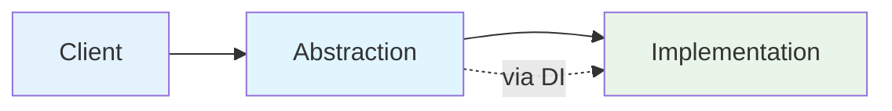
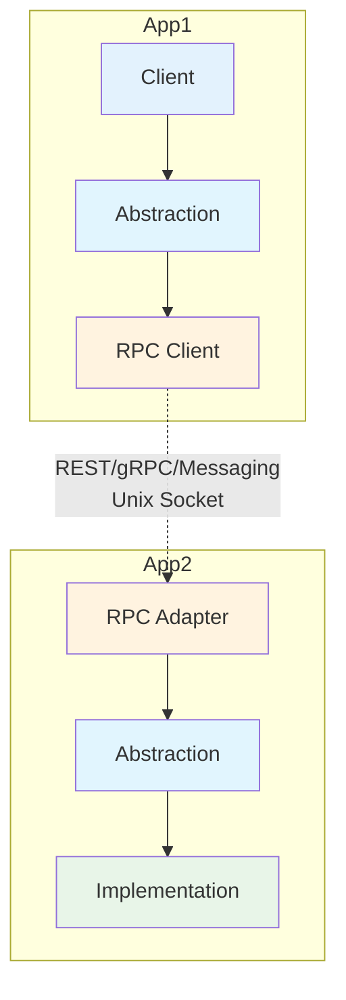

# Welcome to MasLazu.AspNet

A comprehensive collection of modern ASP.NET Core libraries and modules designed to accelerate enterprise application development with clean architecture principles.

## What is MasLazu.AspNet?

MasLazu.AspNet is a modular ecosystem that provides everything you need to build scalable, maintainable, and secure web applications. From foundational frameworks to specialized modules for authentication, authorization, and communication.

## 🏗️ Architecture Overview

MasLazu.AspNet implements a **Ports and Adapters (Hexagonal Architecture)** pattern that provides exceptional flexibility and maintainability. This architecture separates _what_ your application does from _how_ it does it.

### Core Architecture Pattern

The fundamental pattern follows this dependency flow:

### Flexible Infrastructure Implementations

The beauty of this architecture is that you can swap infrastructure implementations without changing your core business logic:

### Deployment Flexibility

Modules can be deployed in multiple ways without code changes:

#### **Direct Usage (Modular Monolith)**

#### **Distributed Services (Microservices)**

### Implementation Variants

You can create different implementations of the same abstraction for various scenarios:

- **User Module** - Basic user management
- **User Module with RBAC** - Role-based access control
- **User Module with ABAC** - Attribute-based access control
- **User Module with Multi-tenancy** - Tenant isolation

All variants share the same abstraction, ensuring **client compatibility** across implementations.

### Key Benefits

- **🔄 Technology Agnostic** - Switch databases, frameworks, or deployment models without core changes
- **🧪 High Testability** - Mock abstractions for fast, reliable unit tests
- **📦 Excellent Modularity** - Self-contained modules with clear boundaries
- **🚀 Deployment Flexibility** - Start as monolith, evolve to microservices
- **🔧 Extensibility** - Add features (RBAC, caching, etc.) without breaking existing clients

## 🎯 What's Included

### 🏗️ **[Framework Components](./framework/overview.md)**

Core building blocks for clean architecture applications:

- **Domain Layer** - Entities, value objects, and domain logic
- **Application Layer** - Services, validation, and business workflows
- **EfCore Layer** - Data access with repository patterns
- **Endpoint Layer** - FastEndpoints integration for high-performance APIs

### 📦 **[Modules](./modules/overview.md)**

Pre-built functionality modules for common requirements:

- **Authentication.Core** - JWT authentication with multi-language support
- **Verification** - Email/SMS verification with secure code generation

### 🔧 **[Utilities](./utilities/overview.md)**

Standalone libraries for specific tasks:

- **EmailSender** - Multi-provider email with beautiful templates (Gmail, SendGrid)
- **Future Utilities** - SMS, file storage, push notifications, and more

## 🚀 Quick Start

### Prerequisites

- .NET 9 or later
- Visual Studio 2022 or VS Code
- SQL Server, PostgreSQL, or other supported database

### Basic Setup

1. Choose the components you need from the [Components Overview](./components/overview.md)
2. Follow the specific setup guides for each component
3. Configure your database and services
4. Start building your application

## 📚 Documentation Structure

- **[Framework](./framework/overview.md)** - Core framework components and layers
- **[Modules](./modules/overview.md)** - Authentication, verification, and feature modules
- **[Utilities](./utilities/overview.md)** - EmailSender and other standalone utilities
- **[Examples](./examples/overview.md)** - Sample implementations and tutorials

## 🎯 Key Features

- **Clean Architecture** - Strict separation of concerns with Domain, Application, Infrastructure, and Presentation layers
- **FastEndpoints Integration** - High-performance minimal APIs with automatic OpenAPI documentation
- **Modular Design** - Use only what you need, extend what you want
- **Enterprise Ready** - Built with scalability, security, and maintainability in mind
- **Modern .NET** - Leverages .NET 9 features including nullable types and records

## 🤝 Contributing

We welcome contributions! Please see our [Contributing Guide](./contributing.md) for details.

## 📄 License

This project is licensed under the MIT License - see the [LICENSE](https://github.com/MasLazu/MasLazu.AspNet/blob/main/LICENSE) file for details.
