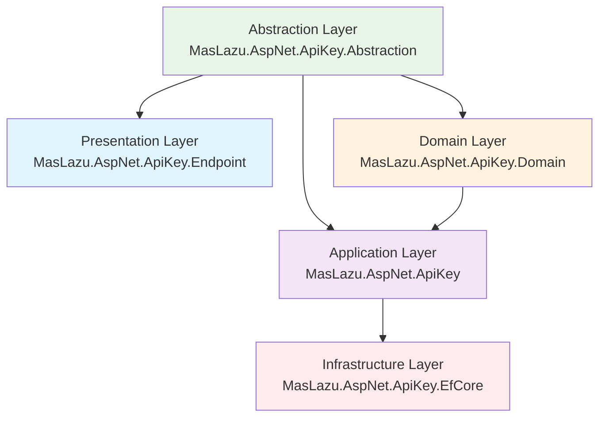

# API Key

A secure API Key Management system for ASP.NET Core applications, built with Clean Architecture principles. Provides key generation, validation, rotation, permission-based access control, and full CRUD operations.

## 🚀 Overview

The API Key Management module enables secure API access using keys linked to users and permission IDs. It supports key creation, validation, rotation, revocation, and permission assignment.

## 📊 Dependency Graph



## ✨ Key Features

- Secure API key generation and validation
- Permission-based access control (scopes are permission IDs)
- Key rotation and revocation
- Full CRUD for API keys and scopes
- Clean Architecture and async/await support
- FluentValidation for request validation
- Entity Framework Core integration
- Comprehensive unit test coverage

## 📦 Installation

Add the following packages to your project:

```xml
<PackageReference Include="MasLazu.AspNet.ApiKey.Abstraction" Version="1.0.0" />
<PackageReference Include="MasLazu.AspNet.ApiKey.Domain" Version="1.0.0" />
<PackageReference Include="MasLazu.AspNet.ApiKey" Version="1.0.0" />
<PackageReference Include="MasLazu.AspNet.ApiKey.EfCore" Version="1.0.0" />
<PackageReference Include="MasLazu.AspNet.ApiKey.Endpoint" Version="1.0.0" />
```

## Service Registration

```csharp
// Register API key services
builder.Services.AddApiKeyApplication();

// Register EF Core DbContext
builder.Services.AddDbContext<ApiKeyDbContext>(options =>
    options.UseSqlServer(connectionString));

// Register endpoints (if using Endpoint project)
builder.Services.AddFastEndpoints();
```

## 🏗️ Core Concepts

### Entities

#### ApiKey

```csharp
public class ApiKey : BaseEntity
{
    public Guid UserId { get; set; }
    public string Key { get; set; } = string.Empty;
    public string? Name { get; set; }
    public DateTime? ExpiresDate { get; set; }
    public DateTime? LastUsed { get; set; }
    public DateTime? RevokedDate { get; set; }
    public ICollection<ApiKeyScope> Scopes { get; set; } = [];
}
```

#### ApiKeyScope

```csharp
public class ApiKeyScope : BaseEntity
{
    public Guid ApiKeyId { get; set; }
    public Guid PermissionId { get; set; }
    public ApiKey? ApiKey { get; set; }
}
```

### Data Transfer Objects

#### ApiKeyDto

```csharp
public record ApiKeyDto(
    Guid Id,
    Guid UserId,
    string Key,
    string? Name,
    DateTimeOffset? ExpiresDate,
    DateTimeOffset? LastUsed,
    DateTimeOffset? RevokedDate,
    DateTimeOffset CreatedAt,
    DateTimeOffset? UpdatedAt
);
```

#### CreateApiKeyRequest

```csharp
public record CreateApiKeyRequest(
    Guid UserId,
    string? Name,
    DateTime? ExpiresDate
);
```

## 🛠️ API Reference

### API Key Endpoints

- `POST /apikeys` - Create API key
- `GET /apikeys` - List API keys (paginated)
- `GET /apikeys/{id}` - Get API key by ID
- `PUT /apikeys/{id}` - Update API key
- `DELETE /apikeys/{id}` - Delete API key
- `POST /apikeys/{id}/revoke` - Revoke API key
- `POST /apikeys/{id}/rotate` - Rotate API key
- `POST /apikeys/validate` - Validate API key
- `GET /apikeys/user/{userId}` - Get all API keys for a user
- `POST /apikeys/revoke-all/{userId}` - Revoke all API keys for a user

### API Key Scope Endpoints

- `POST /apikeys/scopes` - Add scope
- `GET /apikeys/scopes` - List scopes (paginated)
- `GET /apikeys/scopes/{id}` - Get scope by ID
- `PUT /apikeys/scopes/{id}` - Update scope
- `DELETE /apikeys/scopes/{id}` - Delete scope

### Example: Create API Key

```http
POST /apikeys
Content-Type: application/json

{
  "userId": "550e8400-e29b-41d4-a716-446655440000",
  "name": "My API Key",
  "expiresDate": "2025-12-31T23:59:59Z"
}
```

**Response:**

```json
{
  "id": "...",
  "userId": "...",
  "key": "...",
  "name": "My API Key",
  "expiresDate": "2025-12-31T23:59:59Z",
  "lastUsed": null,
  "revokedDate": null,
  "createdAt": "...",
  "updatedAt": null
}
```

### Example: Validate API Key

```http
POST /apikeys/validate
Content-Type: application/json

{
  "key": "...",
  "permissionId": "..." // optional
}
```

**Response:**

```json
true
```

## 💻 Usage Example

```csharp
// Inject the API key service
private readonly IApiKeyService _apiKeyService;

// Create API key
var request = new CreateApiKeyRequest(userId, "My API Key", DateTime.UtcNow.AddDays(30));
var apiKey = await _apiKeyService.CreateAsync(userId, request);

// Validate API key
var isValid = await _apiKeyService.ValidateAsync(new ValidateApiKeyRequest("api-key", permissionId));

// Rotate API key
var rotatedKey = await _apiKeyService.RotateAsync(userId, apiKey.Id);
```

## 🔧 Configuration

### Database Migration

```bash
# Add migration
dotnet ef migrations add InitialCreate --project src/MasLazu.AspNet.ApiKey.EfCore

# Update database
dotnet ef database update --project src/MasLazu.AspNet.ApiKey.EfCore
```

### Appsettings.json

```json
{
  "ConnectionStrings": {
    "ApiKeyDb": "Server=.;Database=ApiKeyDb;Trusted_Connection=True;"
  }
}
```

## 🏗️ Project Structure

```
src/
├── MasLazu.AspNet.ApiKey.Abstraction/
│   ├── Interfaces/           # Service interfaces
│   └── Models/              # DTOs and request/response models
├── MasLazu.AspNet.ApiKey.Domain/
│   └── Entities/            # Domain entities (ApiKey, ApiKeyScope)
├── MasLazu.AspNet.ApiKey/
│   ├── Extensions/          # Service registration extensions
│   ├── Services/            # Business logic implementations
│   └── Validators/          # FluentValidation validators
├── MasLazu.AspNet.ApiKey.EfCore/
│   ├── Configurations/      # Entity configurations
│   ├── Data/               # DbContext and repositories
│   └── Extensions/         # EF Core service registration
└── MasLazu.AspNet.ApiKey.Endpoint/
    ├── EndpointGroups/     # Endpoint grouping
    ├── Endpoints/          # FastEndpoints implementations
    └── Extensions/         # Endpoint registration

test/
├── MasLazu.AspNet.ApiKey.Test/
├── MasLazu.AspNet.ApiKey.EfCore.Test/
└── MasLazu.AspNet.ApiKey.Endpoint.Test/
```

## 🧪 Testing

Run the test suite:

```bash
dotnet test test/MasLazu.AspNet.ApiKey.Test/
```

## 🔒 Security Features

- Secure key generation (GUID-based)
- Key validation with expiration and revocation
- Permission-based access control (permission IDs)
- FluentValidation for all requests
- Audit trail with timestamps

## 📚 Related Documentation

- [Framework Application](../framework/application.md)
- [Framework EF Core](../framework/efcore.md)
- [FastEndpoints](../framework/endpoint.md)
- [Authorization Core](./authorization-core.md)

## 🤝 Contributing

Contributions are welcome! Please ensure:

1. All tests pass
2. Code follows the established patterns
3. Documentation is updated
4. Security best practices are followed
5. FluentValidation rules are comprehensive

## 📄 License

This project is licensed under the MIT License - see the [LICENSE](../../../LICENSE) file for details.
