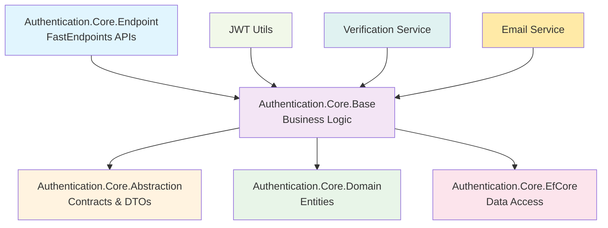
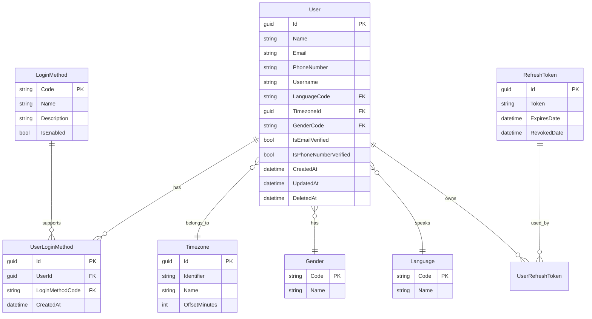

# Authentication Core

A comprehensive authentication and user management module built on MasLazu.AspNet Framework, providing JWT-based authentication, user profile management, and multi-language support with clean architecture principles.

## 🎯 Purpose

The Authentication.Core module provides a complete authentication system:

- **JWT Authentication** with access and refresh tokens
- **User Management** with comprehensive profiles
- **Multi-Login Methods** support (email, phone, etc.)
- **Email/Phone Verification** workflows
- **Reference Data Management** (languages, timezones, genders)
- **High-Performance APIs** using FastEndpoints

## 📦 Installation

```bash
# Core abstractions and interfaces
dotnet add package MasLazu.AspNet.Authentication.Core.Abstraction

# Business logic implementations
dotnet add package MasLazu.AspNet.Authentication.Core.Base

# Domain entities
dotnet add package MasLazu.AspNet.Authentication.Core.Domain

# API endpoints
dotnet add package MasLazu.AspNet.Authentication.Core.Endpoint

# Database implementation
dotnet add package MasLazu.AspNet.Authentication.Core.EfCore
```

## 🏗️ Architecture Overview



## 🚀 Core Features

### 1. **JWT Authentication System**

```csharp
public class AuthService : IAuthService
{
    public async Task<LoginResponse> LoginAsync(Guid userLoginMethodId, CancellationToken ct = default)
    {
        // Validate user and login method
        var userLoginMethod = await _userLoginMethodRepository.GetByIdAsync(userLoginMethodId, ct);
        var user = await _userRepository.GetByIdAsync(userLoginMethod.UserId, ct);

        // Generate tokens
        var (accessToken, accessTokenExpiresAt) = _jwtUtil.GenerateAccessToken(user.Id, user.Email);
        var (refreshToken, refreshTokenExpiresAt) = _jwtUtil.GenerateRefreshToken(user.Id);

        return new LoginResponse(
            accessToken,
            refreshToken,
            accessTokenExpiresAt,
            refreshTokenExpiresAt
        );
    }
}
```

### 2. **User Management**

```csharp
public class UserService : CrudService<User, UserDto, CreateUserRequest, UpdateUserRequest>
{
    public async Task<UserDto> CreateUserWithVerificationAsync(
        CreateUserRequest request,
        CancellationToken ct = default)
    {
        // Create user
        var user = await CreateAsync(Guid.Empty, request, ct);

        // Send verification email
        if (!string.IsNullOrEmpty(request.Email))
        {
            await _verificationService.SendEmailVerificationAsync(user.Id, request.Email, ct);
        }

        return user;
    }

    public async Task<UserDto> VerifyEmailAsync(Guid userId, string code, CancellationToken ct = default)
    {
        // Verify the code
        var isValid = await _verificationService.VerifyEmailAsync(userId, code, ct);
        if (!isValid)
            throw new ValidationException("Invalid verification code");

        // Update user
        var user = await Repository.GetByIdAsync(userId, ct);
        user.IsEmailVerified = true;
        user.UpdatedAt = DateTime.UtcNow;

        await Repository.UpdateAsync(user, ct);
        await UnitOfWork.SaveChangesAsync(ct);

        return user.Adapt<UserDto>();
    }
}
```

### 3. **Multi-Language & Timezone Support**

```csharp
public class User : BaseEntity
{
    public string Name { get; set; } = string.Empty;
    public string Email { get; set; } = string.Empty;
    public string? PhoneNumber { get; set; }
    public string? Username { get; set; }

    // Localization
    public string LanguageCode { get; set; } = "en";
    public Guid? TimezoneId { get; set; }
    public string? GenderCode { get; set; }

    // Verification status
    public bool IsEmailVerified { get; set; }
    public bool IsPhoneNumberVerified { get; set; }

    // Navigation properties
    public Timezone? Timezone { get; set; }
    public Gender? Gender { get; set; }
    public Language? Language { get; set; }
    public ICollection<UserLoginMethod> UserLoginMethods { get; set; } = new List<UserLoginMethod>();
}
```

## 🔧 Configuration & Setup

### 1. **JWT Configuration**

```json
{
  "Jwt": {
    "Key": "your-super-secret-jwt-signing-key-256-bits-minimum",
    "Secret": "your-super-secret-jwt-signing-key-256-bits-minimum",
    "Issuer": "https://yourapp.com",
    "Audience": "https://yourapp.com",
    "AccessTokenExpirationMinutes": 120,
    "RefreshTokenExpirationDays": 30
  }
}
```

### 2. **Service Registration**

```csharp
// Program.cs
var builder = WebApplication.CreateBuilder(args);

// JWT Configuration
builder.Services.Configure<JwtConfiguration>(
    builder.Configuration.GetSection("Jwt"));

// Authentication Core Services
builder.Services.AddAuthenticationCoreApplicationServices();

// Database
builder.Services.AddDbContext<AuthenticationDbContext>(options =>
    options.UseNpgsql(connectionString));

// Framework services
builder.Services.AddFrameworkApplication();
builder.Services.AddFrameworkEfCore();
builder.Services.AddRepositoriesForAllEntities<AuthenticationDbContext>();

var app = builder.Build();
```

### 3. **Authentication Setup**

```csharp
// Configure JWT authentication
builder.Services.AddAuthentication(JwtBearerDefaults.AuthenticationScheme)
    .AddJwtBearer(options =>
    {
        var jwtConfig = builder.Configuration.GetSection("Jwt").Get<JwtConfiguration>();

        options.TokenValidationParameters = new TokenValidationParameters
        {
            ValidateIssuerSigningKey = true,
            IssuerSigningKey = new SymmetricSecurityKey(Encoding.UTF8.GetBytes(jwtConfig.Key)),
            ValidateIssuer = true,
            ValidIssuer = jwtConfig.Issuer,
            ValidateAudience = true,
            ValidAudience = jwtConfig.Audience,
            ValidateLifetime = true,
            ClockSkew = TimeSpan.Zero
        };
    });

builder.Services.AddAuthorization();
```

## 📊 Domain Model

### Entity Relationships



## 🔌 API Endpoints

### Authentication Endpoints

```http
# Login with user login method
POST /api/v1/auth/login
Content-Type: application/json

{
  "userLoginMethodId": "550e8400-e29b-41d4-a716-446655440000"
}

# Get user login method by user ID
GET /api/v1/auth/user-login-method/{userId}
Authorization: Bearer {access_token}
```

### User Management Endpoints

```http
# Get all users (paginated)
GET /api/v1/users?page=1&pageSize=20&orderBy=name&orderDirection=asc
Authorization: Bearer {access_token}

# Get user by ID
GET /api/v1/users/{id}
Authorization: Bearer {access_token}

# Create new user
POST /api/v1/users
Content-Type: application/json

{
  "name": "John Doe",
  "email": "john.doe@example.com",
  "phoneNumber": "+1234567890",
  "languageCode": "en",
  "genderCode": "M"
}

# Update user
PUT /api/v1/users/{id}
Authorization: Bearer {access_token}
Content-Type: application/json

{
  "name": "John Smith",
  "phoneNumber": "+1234567891"
}

# Verify email
POST /api/v1/users/{id}/verify-email
Authorization: Bearer {access_token}
Content-Type: application/json

{
  "verificationCode": "123456"
}
```

### Reference Data Endpoints

```http
# Get all languages
GET /api/v1/languages

# Get all timezones
GET /api/v1/timezones

# Get all genders
GET /api/v1/genders

# Get enabled login methods
GET /api/v1/login-methods/enabled
```

## 🎯 Usage Examples

### 1. **Complete Authentication Flow**

```csharp
public class AuthenticationController : ControllerBase
{
    private readonly IAuthService _authService;
    private readonly IUserService _userService;

    [HttpPost("register")]
    public async Task<ActionResult<UserDto>> RegisterAsync(CreateUserRequest request)
    {
        var user = await _userService.CreateUserWithVerificationAsync(request);
        return CreatedAtAction(nameof(GetUser), new { id = user.Id }, user);
    }

    [HttpPost("verify-email")]
    public async Task<ActionResult<UserDto>> VerifyEmailAsync(Guid userId, VerifyEmailRequest request)
    {
        var user = await _userService.VerifyEmailAsync(userId, request.Code);
        return Ok(user);
    }

    [HttpPost("login")]
    public async Task<ActionResult<LoginResponse>> LoginAsync(LoginRequest request)
    {
        var response = await _authService.LoginAsync(request.UserLoginMethodId);
        return Ok(response);
    }
}
```

### 2. **Custom User Service Extension**

```csharp
public class ExtendedUserService : UserService
{
    private readonly ILogger<ExtendedUserService> _logger;
    private readonly IEmailService _emailService;

    public override async Task<UserDto> CreateAsync(Guid userId, CreateUserRequest createRequest, CancellationToken ct = default)
    {
        // Custom validation
        if (await Repository.AnyAsync(u => u.Email == createRequest.Email, ct))
            throw new BusinessException("Email already exists");

        // Create user
        var user = await base.CreateAsync(userId, createRequest, ct);

        // Send welcome email
        await _emailService.SendWelcomeEmailAsync(user.Email, user.Name, ct);

        _logger.LogInformation("Created user {UserId} with email {Email}", user.Id, user.Email);

        return user;
    }
}
```

### 3. **JWT Token Validation Middleware**

```csharp
public class JwtMiddleware
{
    private readonly RequestDelegate _next;
    private readonly JwtUtil _jwtUtil;

    public async Task InvokeAsync(HttpContext context)
    {
        var token = context.Request.Headers["Authorization"]
            .FirstOrDefault()?.Split(" ").Last();

        if (token != null)
        {
            var principal = _jwtUtil.ValidateAccessToken(token);
            if (principal != null)
            {
                context.User = principal;
            }
        }

        await _next(context);
    }
}
```

## 📁 Project Structure

```
MasLazu.AspNet.Authentication.Core/
├── src/
│   ├── MasLazu.AspNet.Authentication.Core.Abstraction/
│   │   ├── Interfaces/
│   │   │   ├── IAuthService.cs
│   │   │   ├── IUserService.cs
│   │   │   └── IGenderService.cs
│   │   ├── Models/
│   │   │   ├── UserDto.cs
│   │   │   ├── LoginResponse.cs
│   │   │   └── CreateUserRequest.cs
│   │   └── MasLazu.AspNet.Authentication.Core.Abstraction.csproj
│   │
│   ├── MasLazu.AspNet.Authentication.Core.Domain/
│   │   ├── Entities/
│   │   │   ├── User.cs
│   │   │   ├── LoginMethod.cs
│   │   │   ├── UserLoginMethod.cs
│   │   │   ├── RefreshToken.cs
│   │   │   └── UserRefreshToken.cs
│   │   └── MasLazu.AspNet.Authentication.Core.Domain.csproj
│   │
│   ├── MasLazu.AspNet.Authentication.Core.Base/
│   │   ├── Services/
│   │   │   ├── AuthService.cs
│   │   │   ├── UserService.cs
│   │   │   └── GenderService.cs
│   │   ├── Utils/
│   │   │   ├── JwtUtil.cs
│   │   │   └── UserEntityPropertyMap.cs
│   │   ├── Configuration/
│   │   │   └── JwtConfiguration.cs
│   │   ├── Extensions/
│   │   │   └── AuthenticationCoreApplicationServiceExtension.cs
│   │   └── MasLazu.AspNet.Authentication.Core.Base.csproj
│   │
│   ├── MasLazu.AspNet.Authentication.Core.Endpoint/
│   │   ├── Endpoints/
│   │   │   ├── Auth/
│   │   │   ├── Users/
│   │   │   └── Reference/
│   │   ├── EndpointGroups/
│   │   │   └── AuthEndpointGroup.cs
│   │   └── MasLazu.AspNet.Authentication.Core.Endpoint.csproj
│   │
│   └── MasLazu.AspNet.Authentication.Core.EfCore/
│       ├── Data/
│       │   └── AuthenticationDbContext.cs
│       ├── Configurations/
│       │   ├── UserConfiguration.cs
│       │   └── LoginMethodConfiguration.cs
│       └── MasLazu.AspNet.Authentication.Core.EfCore.csproj
│
├── MasLazu.AspNet.Authentication.Core.sln
└── README.md
```

## 🔗 Dependencies

```xml
<!-- Core Framework -->
<PackageReference Include="MasLazu.AspNet.Framework.Application" />
<PackageReference Include="MasLazu.AspNet.Framework.Domain" />
<PackageReference Include="MasLazu.AspNet.Framework.EfCore" />
<PackageReference Include="MasLazu.AspNet.Framework.Endpoint" />

<!-- Authentication -->
<PackageReference Include="Microsoft.AspNetCore.Authentication.JwtBearer" />
<PackageReference Include="System.IdentityModel.Tokens.Jwt" />

<!-- Validation & Mapping -->
<PackageReference Include="FluentValidation" />
<PackageReference Include="Mapster" />

<!-- Database -->
<PackageReference Include="Microsoft.EntityFrameworkCore" />
<PackageReference Include="Npgsql.EntityFrameworkCore.PostgreSQL" />

<!-- External Services -->
<PackageReference Include="MasLazu.AspNet.Verification.Abstraction" />
```

## ✅ Best Practices

### ✅ Do's

- **Use JWT tokens** for stateless authentication
- **Implement refresh tokens** for security
- **Validate email/phone** before allowing login
- **Use secure token generation** with proper expiration
- **Implement proper error handling** for authentication failures
- **Use dependency injection** for all services

### ❌ Don'ts

- **Don't store sensitive data** in JWT payload
- **Don't use weak signing keys** (minimum 256 bits)
- **Don't ignore token expiration** validation
- **Don't expose internal user IDs** in public APIs
- **Don't skip input validation** on authentication endpoints

## 🎯 Security Considerations

### 1. **Token Security**

```csharp
// Use strong, random keys
services.Configure<JwtConfiguration>(options =>
{
    options.Key = Environment.GetEnvironmentVariable("JWT_KEY") ??
                  throw new InvalidOperationException("JWT_KEY is required");
});
```

### 2. **Rate Limiting**

```csharp
services.AddRateLimiter(options =>
{
    options.AddFixedWindowLimiter("AuthPolicy", limiterOptions =>
    {
        limiterOptions.PermitLimit = 5;
        limiterOptions.Window = TimeSpan.FromMinutes(1);
    });
});
```

### 3. **Input Validation**

```csharp
public class CreateUserRequestValidator : AbstractValidator<CreateUserRequest>
{
    public CreateUserRequestValidator()
    {
        RuleFor(x => x.Email)
            .NotEmpty()
            .EmailAddress()
            .MaximumLength(254);

        RuleFor(x => x.Name)
            .NotEmpty()
            .MinimumLength(2)
            .MaximumLength(100);
    }
}
```

## 🎯 Next Steps

After implementing Authentication.Core:

1. **[Verification Module](./verification.md)** - Email/SMS verification
2. **[Authorization Modules](../examples/authorization.md)** - RBAC, ABAC implementation
3. **[Performance Optimization](../examples/performance.md)** - Caching and optimization

## 📚 Related Documentation

- [Framework Overview](../framework/overview.md) - Core framework concepts
- [Modules Overview](./overview.md) - Other available modules
- [Getting Started](../getting-started/installation.md) - Setup guide
