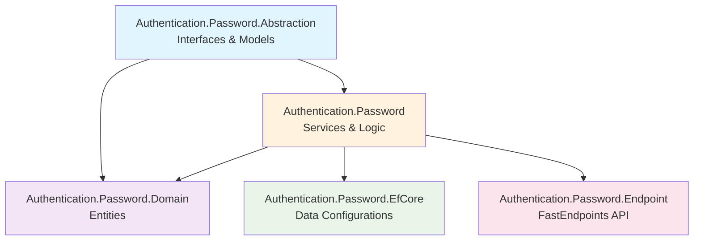
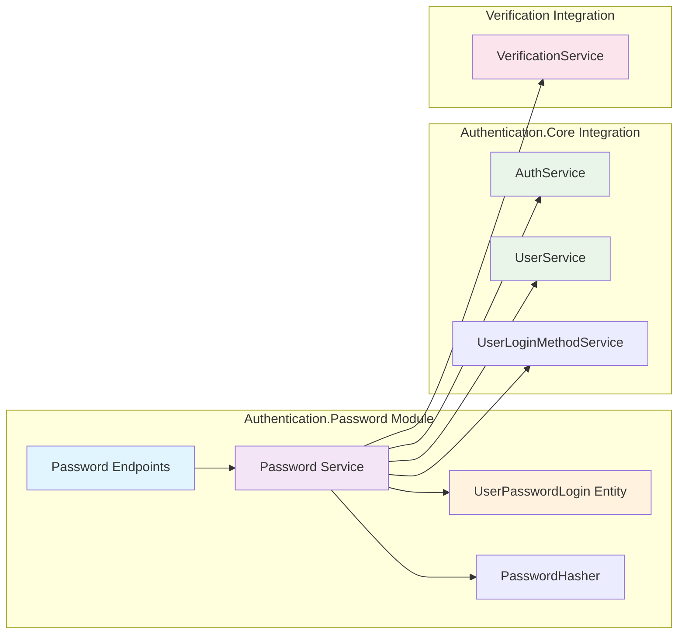

# Authentication.Password

A secure password-based authentication module that integrates with the MasLazu.AspNet.Authentication.Core framework. This module provides password authentication functionality with BCrypt hashing, user registration, and login capabilities.

## 🎯 Purpose

The Authentication.Password module extends the core authentication system with password-based login functionality:

- **User Registration** - Account creation with password-based authentication
- **Password Login** - Secure authentication using BCrypt hashing
- **Password Management** - Change password functionality
- **Email Verification** - Optional email verification integration
- **Clean Architecture** - Follows framework patterns with clear separation of concerns

## 📦 Package Structure



## 🏗️ Architecture Overview

This module integrates with the existing Authentication.Core framework:



## 🚀 Installation

```bash
# Core password authentication
dotnet add package MasLazu.AspNet.Authentication.Password

# Database layer
dotnet add package MasLazu.AspNet.Authentication.Password.EfCore

# API endpoints
dotnet add package MasLazu.AspNet.Authentication.Password.Endpoint

# Abstractions (for DI)
dotnet add package MasLazu.AspNet.Authentication.Password.Abstraction
```

## ⚙️ Configuration

### **1. Service Registration**

```csharp
// Program.cs
var builder = WebApplication.CreateBuilder(args);

// Add Authentication.Core (required dependency)
builder.Services.AddAuthenticationCoreApplication(builder.Configuration);

// Add Password Authentication
builder.Services.AddAuthenticationPasswordApplication(builder.Configuration);

// Add EF Core for Password entities
builder.Services.AddAuthenticationPasswordEntityFrameworkCore();

// Add endpoints
builder.Services.AddFastEndpoints();

var app = builder.Build();

app.UseAuthentication();
app.UseAuthorization();
app.UseFastEndpoints();

app.Run();
```

### **2. Configuration Settings**

```json
{
  "PasswordLoginMethod": {
    "RequireVerification": true,
    "PasswordValidation": {
      "MinLength": 8,
      "RequireUppercase": true,
      "RequireLowercase": true,
      "RequireDigit": true,
      "RequireSpecialCharacter": false
    }
  }
}
```

## 🔐 Core Features

### **1. User Registration**

```csharp
public record PasswordRegisterRequest(
    string Name,
    string Username,
    string Email,
    string Password
);

// API: POST /auth/register
var request = new PasswordRegisterRequest(
    Name: "John Doe",
    Username: "johndoe",
    Email: "john.doe@example.com",
    Password: "SecurePass123!"
);
```

### **2. User Login**

```csharp
public record PasswordLoginRequest(
    string Identifier,  // Email or Username
    string Password
);

// API: POST /auth/login
var loginRequest = new PasswordLoginRequest(
    Identifier: "john.doe@example.com", // or "johndoe"
    Password: "SecurePass123!"
);
```

### **3. Password Change**

```csharp
public record ChangePasswordRequest(
    string CurrentPassword,
    string NewPassword
);

// API: POST /auth/change-password (requires authentication)
var changeRequest = new ChangePasswordRequest(
    CurrentPassword: "OldPass123!",
    NewPassword: "NewSecurePass456!"
);
```

## 🛡️ Security Implementation

### **1. BCrypt Password Hashing**

```csharp
public static class PasswordHasher
{
    private const int WorkFactor = 12; // 2^12 = 4096 iterations

    public static string HashPassword(string password)
    {
        return BCrypt.Net.BCrypt.HashPassword(password, WorkFactor);
    }

    public static bool VerifyPassword(string hashedPassword, string providedPassword)
    {
        return BCrypt.Net.BCrypt.Verify(providedPassword, hashedPassword);
    }
}
```

### **2. Password Validation Configuration**

```csharp
public class PasswordValidationConfiguration
{
    public int MinLength { get; set; } = 8;
    public bool RequireUppercase { get; set; } = true;
    public bool RequireLowercase { get; set; } = true;
    public bool RequireDigit { get; set; } = true;
    public bool RequireSpecialCharacter { get; set; } = false;
}
```

## 📊 Database Schema

### **UserPasswordLogin Entity**

```csharp
public class UserPasswordLogin : BaseEntity
{
    public Guid UserId { get; set; }
    public Guid UserLoginMethodId { get; set; }
    public bool IsVerified { get; set; }
    public string PasswordHash { get; set; } = string.Empty;
    public DateTime? LastLoginDate { get; set; }
}
```

### **Entity Configuration**

```csharp
public class UserPasswordLoginConfiguration : IEntityTypeConfiguration<UserPasswordLogin>
{
    public void Configure(EntityTypeBuilder<UserPasswordLogin> builder)
    {
        builder.HasKey(upl => upl.Id);

        builder.Property(upl => upl.UserLoginMethodId)
            .IsRequired();

        builder.Property(upl => upl.PasswordHash)
            .IsRequired()
            .HasMaxLength(500);

        builder.HasIndex(upl => upl.UserLoginMethodId)
            .IsUnique();
    }
}
```

## 🔗 API Endpoints

All endpoints are grouped under `/auth` prefix:

| Method | Endpoint                | Description       | Request                 | Authentication |
| ------ | ----------------------- | ----------------- | ----------------------- | -------------- |
| POST   | `/auth/register`        | Register new user | PasswordRegisterRequest | None           |
| POST   | `/auth/login`           | User login        | PasswordLoginRequest    | None           |
| POST   | `/auth/change-password` | Change password   | ChangePasswordRequest   | Required       |

### **Registration Flow**

```csharp
// 1. Register user
var registerResponse = await httpClient.PostAsJsonAsync("/auth/register", new PasswordRegisterRequest(
    Name: "John Doe",
    Username: "johndoe",
    Email: "john@example.com",
    Password: "SecurePass123!"
));

// 2. Email verification sent automatically (if configured)
// 3. User can login after verification (if required)
```

### **Login Flow**

```csharp
// Login with email or username
var loginResponse = await httpClient.PostAsJsonAsync("/auth/login", new PasswordLoginRequest(
    Identifier: "john@example.com", // or "johndoe"
    Password: "SecurePass123!"
));

var loginResult = await loginResponse.Content.ReadFromJsonAsync<PasswordLoginResponse>();
// Returns JWT tokens from Authentication.Core
```

## 🔧 Service Implementation

### **Core Service Interface**

```csharp
public interface IUserPasswordLoginService : ICrudService<UserPasswordLoginDto, CreateUserPasswordLoginRequest, UpdateUserPasswordLoginRequest>
{
    Task<PasswordLoginResponse> LoginAsync(PasswordLoginRequest request, CancellationToken ct);
    Task RegisterAsync(PasswordRegisterRequest request, CancellationToken ct);
    Task ChangePasswordAsync(Guid userId, ChangePasswordRequest request, CancellationToken ct);
}
```

### **Registration Process**

The service integrates with multiple systems:

1. **User Creation** - Uses `IUserService` from Authentication.Core
2. **Login Method** - Creates entry in `IUserLoginMethodService`
3. **Password Storage** - Stores BCrypt hash in `UserPasswordLogin`
4. **Email Verification** - Triggers verification email if enabled

### **Login Validation**

```csharp
public async Task<PasswordLoginResponse> LoginAsync(PasswordLoginRequest request, CancellationToken ct)
{
    // 1. Find user by email or username
    UserDto user = await _userService.GetByUsernameOrEmailAsync(request.Identifier, ct);

    // 2. Get password login record
    UserPasswordLogin? userPasswordLogin = await ReadRepository.FirstOrDefaultAsync(upl => upl.UserId == user.Id, ct);

    // 3. Verify password with BCrypt
    if (!PasswordHasher.VerifyPassword(userPasswordLogin.PasswordHash, request.Password))
        throw new UnauthorizedException("Invalid username/email or password.");

    // 4. Check verification status
    if (_passwordConfig.RequireVerification && !userPasswordLogin.IsVerified)
        throw new UnauthorizedException("Account not verified.");

    // 5. Generate JWT tokens via Authentication.Core
    return (await _authService.LoginAsync(userPasswordLogin.UserLoginMethodId, ct)).Adapt<PasswordLoginResponse>();
}
```

## 🧪 Testing Examples

### **Integration Test Setup**

```csharp
public class PasswordAuthenticationTests : IClassFixture<WebApplicationFactory<Program>>
{
    private readonly HttpClient _client;

    public PasswordAuthenticationTests(WebApplicationFactory<Program> factory)
    {
        _client = factory.CreateClient();
    }

    [Fact]
    public async Task Register_ValidRequest_ReturnsSuccess()
    {
        var request = new PasswordRegisterRequest(
            Name: "Test User",
            Username: "testuser",
            Email: "test@example.com",
            Password: "TestPass123!"
        );

        var response = await _client.PostAsJsonAsync("/auth/register", request);

        response.StatusCode.Should().Be(HttpStatusCode.OK);
    }

    [Fact]
    public async Task Login_ValidCredentials_ReturnsTokens()
    {
        // Arrange: First register a user
        await RegisterTestUser();

        // Act: Login
        var loginRequest = new PasswordLoginRequest("test@example.com", "TestPass123!");
        var response = await _client.PostAsJsonAsync("/auth/login", loginRequest);

        // Assert
        response.StatusCode.Should().Be(HttpStatusCode.OK);
        var loginResponse = await response.Content.ReadFromJsonAsync<PasswordLoginResponse>();
        loginResponse.AccessToken.Should().NotBeNullOrEmpty();
    }
}
```

## 📁 Project Structure

Based on actual implementation:

```
MasLazu.AspNet.Authentication.Password/
├── src/
│   ├── MasLazu.AspNet.Authentication.Password.Abstraction/
│   │   ├── Interfaces/
│   │   │   └── IUserPasswordLoginService.cs
│   │   └── Models/
│   │       ├── PasswordRegisterRequest.cs
│   │       ├── PasswordLoginRequest.cs
│   │       ├── ChangePasswordRequest.cs
│   │       └── UserPasswordLoginDto.cs
│   │
│   ├── MasLazu.AspNet.Authentication.Password.Domain/
│   │   └── Entities/
│   │       └── UserPasswordLogin.cs
│   │
│   ├── MasLazu.AspNet.Authentication.Password/
│   │   ├── Services/
│   │   │   └── UserPasswordLoginService.cs
│   │   ├── Utils/
│   │   │   └── PasswordHasher.cs
│   │   ├── Configurations/
│   │   │   └── PasswordLoginMethodConfiguration.cs
│   │   └── Extensions/
│   │       └── AuthenticationPasswordApplicationExtension.cs
│   │
│   ├── MasLazu.AspNet.Authentication.Password.EfCore/
│   │   ├── Configurations/
│   │   │   └── UserPasswordLoginConfiguration.cs
│   │   └── Extensions/
│   │       └── ServiceCollectionExtensions.cs
│   │
│   └── MasLazu.AspNet.Authentication.Password.Endpoint/
│       ├── Endpoints/
│       │   ├── RegisterEndpoint.cs
│       │   ├── LoginEndpoint.cs
│       │   └── ChangePasswordEndpoint.cs
│       └── EndpointGroups/
│           └── AuthEndpointGroup.cs
│
└── MasLazu.AspNet.Authentication.Password.sln
```

## 🔗 Dependencies

### **Required Framework Components**

- `MasLazu.AspNet.Authentication.Core.Abstraction` - Core authentication services
- `MasLazu.AspNet.Framework.Application` - Base application layer
- `MasLazu.AspNet.Verification.Abstraction` - Email verification (optional)

### **External Packages**

- `BCrypt.Net-Next` - Password hashing
- `FastEndpoints` - API endpoints
- `Entity Framework Core` - Data access

## ✅ Best Practices

### ✅ **Security Do's**

- **Use BCrypt** with work factor 12 for password hashing
- **Integrate with verification** for email confirmation
- **Leverage Authentication.Core** for JWT token management
- **Validate all inputs** with FluentValidation
- **Use records** for immutable request/response models

### ❌ **Security Don'ts**

- **Don't store plain passwords** - always use BCrypt hash
- **Don't skip verification** when security is critical
- **Don't bypass the core auth system** - use provided services
- **Don't log sensitive data** - exclude passwords from logs

## 🎯 Integration Points

### **With Authentication.Core**

```csharp
// Password module uses core services for:
// - User management (IUserService)
// - JWT tokens (IAuthService)
// - Login methods (IUserLoginMethodService)
```

### **With Verification Module**

```csharp
// Email verification integration:
await _userService.SendEmailVerificationAsync(userDto.Email!, ct);
```

### **With Framework**

```csharp
// Extends framework base classes:
// - CrudService for standard operations
// - BaseEntity for domain entities
// - BaseEndpoint for API endpoints
```

## 🎯 Next Steps

1. **[Authentication.Core](./authentication-core.md)** - Core JWT authentication and user management
2. **[Verification Module](./verification.md)** - Email verification integration
3. **[Framework Overview](../framework/overview.md)** - Understanding the base framework

## 📚 Related Documentation

- [Authentication.Core Module](./authentication-core.md) - Core authentication system
- [Verification Module](./verification.md) - Email verification workflows
- [Framework Application Layer](../framework/application.md) - Base service patterns
- [Framework Domain Layer](../framework/domain.md) - Entity base classes
