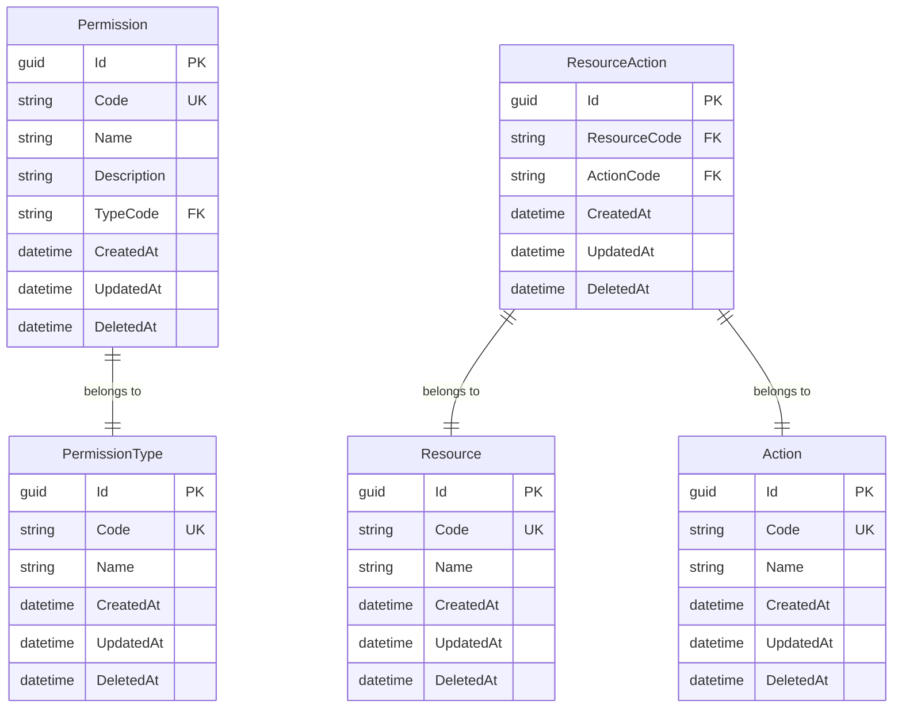

# Authorization Core

A comprehensive, modular authorization system built with .NET 9, designed to provide flexible and scalable access control for ASP.NET Core applications.

## 🎯 Purpose

The Authorization.Core module provides a complete authorization system based on the **Resource-Action-Permission** model:

- **Flexible Permission System** with types and categories
- **Resource-Based Access Control** with granular action permissions
- **Hierarchical Authorization** with configurable permission types
- **High-Performance APIs** using FastEndpoints
- **Clean Architecture** with full separation of concerns
- **Comprehensive Testing** with 54+ unit tests

## 📦 Installation

```bash
# Core abstractions and interfaces
dotnet add package MasLazu.AspNet.Authorization.Core.Abstraction

# Domain entities
dotnet add package MasLazu.AspNet.Authorization.Core.Domain

# Business logic implementations
dotnet add package MasLazu.AspNet.Authorization.Core

# Database implementation
dotnet add package MasLazu.AspNet.Authorization.Core.EfCore

# API endpoints
dotnet add package MasLazu.AspNet.Authorization.Core.Endpoint
```

## ⚙️ Configuration

### 1. Add Services

```csharp
// Program.cs
using MasLazu.AspNet.Authorization.Core.Extensions;

var builder = WebApplication.CreateBuilder(args);

// Add authorization services
builder.Services.AddAuthorizationCoreApplicationServices();
builder.Services.AddAuthorizationCoreApplicationUtils();

// Add database context
builder.Services.AddAuthorizationCoreEntityFrameworkCore();
builder.Services.AddDbContext<AuthorizationCoreDbContext>(options =>
    options.UseSqlServer(connectionString));

var app = builder.Build();

// Configure endpoints
app.UseAuthorizationCoreEndpoints();
```

### 2. Database Migration

```bash
dotnet ef migrations add InitialCreate --project MasLazu.AspNet.Authorization.Core.EfCore
dotnet ef database update
```

### 3. Dependency Injection

```csharp
public class AuthorizationController : ControllerBase
{
    private readonly IActionService _actionService;
    private readonly IPermissionService _permissionService;
    private readonly IResourceService _resourceService;

    public AuthorizationController(
        IActionService actionService,
        IPermissionService permissionService,
        IResourceService resourceService)
    {
        _actionService = actionService;
        _permissionService = permissionService;
        _resourceService = resourceService;
    }
}
```

## 🏗️ Core Concepts

### Actions

**Actions** represent system operations that can be performed:

```csharp
// Examples of actions
var readAction = new CreateActionRequest
{
    Code = "READ",
    Name = "Read"
};

var writeAction = new CreateActionRequest
{
    Code = "WRITE",
    Name = "Write"
};

var deleteAction = new CreateActionRequest
{
    Code = "DELETE",
    Name = "Delete"
};
```

### Resources

**Resources** represent protected entities or features in your system:

```csharp
// Examples of resources
var userResource = new CreateResourceRequest
{
    Code = "USER",
    Name = "User Management"
};

var reportResource = new CreateResourceRequest
{
    Code = "REPORT",
    Name = "System Reports"
};
```

### Permission Types

**Permission Types** categorize permissions for better organization:

```csharp
// Examples of permission types
var systemType = new CreatePermissionTypeRequest
{
    Code = "SYSTEM",
    Name = "System Permissions"
};

var userType = new CreatePermissionTypeRequest
{
    Code = "USER",
    Name = "User Permissions"
};
```

### Permissions

**Permissions** combine actions with resources and types:

```csharp
// Create a permission
var permission = new CreatePermissionRequest
{
    Code = "USER_READ",
    Name = "Read Users",
    Description = "Permission to read user data",
    TypeCode = "SYSTEM"
};
```

### Resource Actions

**Resource Actions** link available actions to specific resources:

```csharp
// Link READ action to USER resource
var resourceAction = new CreateResourceActionRequest
{
    ResourceCode = "USER",
    ActionCode = "READ"
};
```

## 📊 Data Model



## 🚀 Usage Examples

### 1. Setting Up Basic Authorization

```csharp
public class AuthorizationSetupService
{
    private readonly IActionService _actionService;
    private readonly IResourceService _resourceService;
    private readonly IPermissionTypeService _permissionTypeService;
    private readonly IPermissionService _permissionService;
    private readonly IResourceActionService _resourceActionService;

    public async Task SetupBasicAuthorizationAsync(Guid userId)
    {
        // 1. Create actions
        var readAction = await _actionService.CreateAsync(userId, new CreateActionRequest
        {
            Code = "READ",
            Name = "Read"
        });

        var writeAction = await _actionService.CreateAsync(userId, new CreateActionRequest
        {
            Code = "WRITE",
            Name = "Write"
        });

        // 2. Create resources
        var userResource = await _resourceService.CreateAsync(userId, new CreateResourceRequest
        {
            Code = "USER",
            Name = "User Management"
        });

        // 3. Create permission types
        var systemType = await _permissionTypeService.CreateAsync(userId, new CreatePermissionTypeRequest
        {
            Code = "SYSTEM",
            Name = "System Permissions"
        });

        // 4. Link actions to resources
        await _resourceActionService.CreateAsync(userId, new CreateResourceActionRequest
        {
            ResourceCode = "USER",
            ActionCode = "READ"
        });

        await _resourceActionService.CreateAsync(userId, new CreateResourceActionRequest
        {
            ResourceCode = "USER",
            ActionCode = "WRITE"
        });

        // 5. Create permissions
        await _permissionService.CreateAsync(userId, new CreatePermissionRequest
        {
            Code = "USER_READ",
            Name = "Read Users",
            Description = "Permission to read user data",
            TypeCode = "SYSTEM"
        });

        await _permissionService.CreateAsync(userId, new CreatePermissionRequest
        {
            Code = "USER_WRITE",
            Name = "Write Users",
            Description = "Permission to create/update user data",
            TypeCode = "SYSTEM"
        });
    }
}
```

### 2. Querying Permissions

```csharp
public class PermissionQueryService
{
    private readonly IPermissionService _permissionService;
    private readonly IResourceActionService _resourceActionService;

    public async Task<bool> UserCanPerformActionAsync(string resourceCode, string actionCode)
    {
        // Check if action is allowed for resource
        var request = new PaginationRequest
        {
            Filters = new List<Filter>
            {
                new() { Field = "resourceCode", Operator = "=", Value = resourceCode },
                new() { Field = "actionCode", Operator = "=", Value = actionCode }
            }
        };

        var result = await _resourceActionService.GetPaginatedAsync(Guid.Empty, request);
        return result.Items.Any();
    }

    public async Task<List<PermissionDto>> GetSystemPermissionsAsync()
    {
        var request = new PaginationRequest
        {
            Filters = new List<Filter>
            {
                new() { Field = "typeCode", Operator = "=", Value = "SYSTEM" }
            }
        };

        var result = await _permissionService.GetPaginatedAsync(Guid.Empty, request);
        return result.Items;
    }
}
```

### 3. Custom Authorization Middleware

```csharp
public class ResourceActionAuthorizationMiddleware
{
    private readonly RequestDelegate _next;
    private readonly IResourceActionService _resourceActionService;

    public ResourceActionAuthorizationMiddleware(
        RequestDelegate next,
        IResourceActionService resourceActionService)
    {
        _next = next;
        _resourceActionService = resourceActionService;
    }

    public async Task InvokeAsync(HttpContext context)
    {
        // Extract resource and action from route/headers
        var resource = context.Request.Headers["X-Resource"].FirstOrDefault();
        var action = context.Request.Headers["X-Action"].FirstOrDefault();

        if (!string.IsNullOrEmpty(resource) && !string.IsNullOrEmpty(action))
        {
            var hasPermission = await CheckPermissionAsync(resource, action);
            if (!hasPermission)
            {
                context.Response.StatusCode = 403;
                await context.Response.WriteAsync("Access denied");
                return;
            }
        }

        await _next(context);
    }

    private async Task<bool> CheckPermissionAsync(string resource, string action)
    {
        var request = new PaginationRequest
        {
            Filters = new List<Filter>
            {
                new() { Field = "resourceCode", Operator = "=", Value = resource },
                new() { Field = "actionCode", Operator = "=", Value = action }
            }
        };

        var result = await _resourceActionService.GetPaginatedAsync(Guid.Empty, request);
        return result.Items.Any();
    }
}

// Register middleware
app.UseMiddleware<ResourceActionAuthorizationMiddleware>();
```

## 📋 API Reference

### Actions Endpoints

| Method | Endpoint               | Description            |
| ------ | ---------------------- | ---------------------- |
| GET    | `/api/v1/actions`      | Get paginated actions  |
| GET    | `/api/v1/actions/{id}` | Get action by ID       |
| POST   | `/api/v1/actions`      | Create new action      |
| PUT    | `/api/v1/actions/{id}` | Update existing action |
| DELETE | `/api/v1/actions/{id}` | Delete action          |

### Resources Endpoints

| Method | Endpoint                 | Description              |
| ------ | ------------------------ | ------------------------ |
| GET    | `/api/v1/resources`      | Get paginated resources  |
| GET    | `/api/v1/resources/{id}` | Get resource by ID       |
| POST   | `/api/v1/resources`      | Create new resource      |
| PUT    | `/api/v1/resources/{id}` | Update existing resource |
| DELETE | `/api/v1/resources/{id}` | Delete resource          |

### Permissions Endpoints

| Method | Endpoint                   | Description                |
| ------ | -------------------------- | -------------------------- |
| GET    | `/api/v1/permissions`      | Get paginated permissions  |
| GET    | `/api/v1/permissions/{id}` | Get permission by ID       |
| POST   | `/api/v1/permissions`      | Create new permission      |
| PUT    | `/api/v1/permissions/{id}` | Update existing permission |
| DELETE | `/api/v1/permissions/{id}` | Delete permission          |

### Permission Types Endpoints

| Method | Endpoint                        | Description                     |
| ------ | ------------------------------- | ------------------------------- |
| GET    | `/api/v1/permission-types`      | Get paginated permission types  |
| GET    | `/api/v1/permission-types/{id}` | Get permission type by ID       |
| POST   | `/api/v1/permission-types`      | Create new permission type      |
| PUT    | `/api/v1/permission-types/{id}` | Update existing permission type |
| DELETE | `/api/v1/permission-types/{id}` | Delete permission type          |

### Resource Actions Endpoints

| Method | Endpoint                        | Description                     |
| ------ | ------------------------------- | ------------------------------- |
| GET    | `/api/v1/resource-actions`      | Get paginated resource actions  |
| GET    | `/api/v1/resource-actions/{id}` | Get resource action by ID       |
| POST   | `/api/v1/resource-actions`      | Create new resource action      |
| PUT    | `/api/v1/resource-actions/{id}` | Update existing resource action |
| DELETE | `/api/v1/resource-actions/{id}` | Delete resource action          |

## 🔍 Advanced Features

### Pagination and Filtering

All endpoints support advanced pagination and filtering:

```bash
# Get permissions with pagination
GET /api/v1/permissions?page=1&pageSize=20

# Filter permissions by type
GET /api/v1/permissions?filters[0].field=typeCode&filters[0].operator=eq&filters[0].value=SYSTEM

# Sort permissions by name
GET /api/v1/permissions?orderBy[0].field=name&orderBy[0].desc=false
```

### Validation

The module includes comprehensive validation:

- **Field Existence**: Validates that filter/sort fields exist
- **Operator Compatibility**: Ensures operators match field types
- **Required Fields**: Validates required properties on requests
- **Unique Constraints**: Prevents duplicate codes

### Property Mapping

Dynamic property mapping for LINQ queries:

```csharp
// Available properties for filtering and sorting
var actionProperties = new[] { "id", "code", "name", "createdAt", "updatedAt" };
var resourceProperties = new[] { "id", "code", "name", "createdAt", "updatedAt" };
var permissionProperties = new[] { "id", "code", "name", "description", "typeCode", "createdAt", "updatedAt" };
```

## 📁 Project Structure

```
MasLazu.AspNet.Authorization.Core/
├── src/
│   ├── MasLazu.AspNet.Authorization.Core.Abstraction/
│   │   ├── Interfaces/
│   │   │   ├── IActionService.cs
│   │   │   ├── IPermissionService.cs
│   │   │   ├── IPermissionTypeService.cs
│   │   │   ├── IResourceService.cs
│   │   │   └── IResourceActionService.cs
│   │   ├── Models/
│   │   │   ├── ActionDto.cs
│   │   │   ├── CreateActionRequest.cs
│   │   │   ├── UpdateActionRequest.cs
│   │   │   ├── PermissionDto.cs
│   │   │   ├── CreatePermissionRequest.cs
│   │   │   ├── UpdatePermissionRequest.cs
│   │   │   ├── ResourceDto.cs
│   │   │   ├── CreateResourceRequest.cs
│   │   │   ├── UpdateResourceRequest.cs
│   │   │   ├── PermissionTypeDto.cs
│   │   │   ├── CreatePermissionTypeRequest.cs
│   │   │   ├── UpdatePermissionTypeRequest.cs
│   │   │   ├── ResourceActionDto.cs
│   │   │   ├── CreateResourceActionRequest.cs
│   │   │   └── UpdateResourceActionRequest.cs
│   │   └── MasLazu.AspNet.Authorization.Core.Abstraction.csproj
│   │
│   ├── MasLazu.AspNet.Authorization.Core.Domain/
│   │   ├── Entities/
│   │   │   ├── Action.cs
│   │   │   ├── Permission.cs
│   │   │   ├── PermissionType.cs
│   │   │   ├── Resource.cs
│   │   │   └── ResourceAction.cs
│   │   └── MasLazu.AspNet.Authorization.Core.Domain.csproj
│   │
│   ├── MasLazu.AspNet.Authorization.Core/
│   │   ├── Services/
│   │   │   ├── ActionService.cs
│   │   │   ├── PermissionService.cs
│   │   │   ├── PermissionTypeService.cs
│   │   │   ├── ResourceService.cs
│   │   │   └── ResourceActionService.cs
│   │   ├── Utils/
│   │   │   ├── ActionEntityPropertyMap.cs
│   │   │   ├── PermissionEntityPropertyMap.cs
│   │   │   ├── PermissionTypeEntityPropertyMap.cs
│   │   │   ├── ResourceEntityPropertyMap.cs
│   │   │   └── ResourceActionEntityPropertyMap.cs
│   │   ├── Validators/
│   │   │   ├── CreateActionRequestValidator.cs
│   │   │   ├── UpdateActionRequestValidator.cs
│   │   │   ├── CreatePermissionRequestValidator.cs
│   │   │   ├── UpdatePermissionRequestValidator.cs
│   │   │   ├── CreateResourceRequestValidator.cs
│   │   │   ├── UpdateResourceRequestValidator.cs
│   │   │   ├── CreatePermissionTypeRequestValidator.cs
│   │   │   ├── UpdatePermissionTypeRequestValidator.cs
│   │   │   ├── CreateResourceActionRequestValidator.cs
│   │   │   └── UpdateResourceActionRequestValidator.cs
│   │   ├── Extensions/
│   │   │   ├── AuthorizationCoreApplicationServiceExtension.cs
│   │   │   ├── AuthorizationCoreApplicationUtilExtension.cs
│   │   │   └── AuthorizationCoreApplicationValidatorExtension.cs
│   │   └── MasLazu.AspNet.Authorization.Core.csproj
│   │
│   ├── MasLazu.AspNet.Authorization.Core.EfCore/
│   │   ├── Configurations/
│   │   │   ├── ActionConfiguration.cs
│   │   │   ├── PermissionConfiguration.cs
│   │   │   ├── PermissionTypeConfiguration.cs
│   │   │   ├── ResourceConfiguration.cs
│   │   │   └── ResourceActionConfiguration.cs
│   │   ├── Data/
│   │   │   └── AuthorizationCoreDbContext.cs
│   │   ├── Extensions/
│   │   │   └── ServiceCollectionExtensions.cs
│   │   └── MasLazu.AspNet.Authorization.Core.EfCore.csproj
│   │
│   └── MasLazu.AspNet.Authorization.Core.Endpoint/
│       ├── EndpointGroups/
│       │   ├── ActionsEndpointGroup.cs
│       │   ├── PermissionsEndpointGroup.cs
│       │   ├── PermissionTypesEndpointGroup.cs
│       │   ├── ResourcesEndpointGroup.cs
│       │   └── ResourceActionsEndpointGroup.cs
│       ├── Endpoints/
│       │   ├── Actions/
│       │   │   ├── GetActionByIdEndpoint.cs
│       │   │   └── GetActionsPaginatedEndpoint.cs
│       │   ├── Permissions/
│       │   │   ├── GetPermissionByIdEndpoint.cs
│       │   │   └── GetPermissionsPaginatedEndpoint.cs
│       │   ├── PermissionTypes/
│       │   │   ├── GetPermissionTypeByIdEndpoint.cs
│       │   │   └── GetPermissionTypesPaginatedEndpoint.cs
│       │   ├── Resources/
│       │   │   ├── GetResourceByIdEndpoint.cs
│       │   │   └── GetResourcesPaginatedEndpoint.cs
│       │   └── ResourceActions/
│       │       ├── GetResourceActionByIdEndpoint.cs
│       │       └── GetResourceActionsPaginatedEndpoint.cs
│       ├── Extensions/
│       │   └── AuthorizationCoreEndpointExtension.cs
│       └── MasLazu.AspNet.Authorization.Core.Endpoint.csproj
│
├── test/                                        # Comprehensive Unit Tests
│   ├── MasLazu.AspNet.Authorization.Core.Abstraction.Tests/
│   ├── MasLazu.AspNet.Authorization.Core.Domain.Tests/
│   ├── MasLazu.AspNet.Authorization.Core.Tests/
│   ├── MasLazu.AspNet.Authorization.Core.EfCore.Tests/
│   └── MasLazu.AspNet.Authorization.Core.Endpoint.Tests/
│
└── MasLazu.AspNet.Authorization.Core.sln
```

## 🔗 Dependencies

```xml
<!-- Core Framework -->
<PackageReference Include="MasLazu.AspNet.Framework.Application" />
<PackageReference Include="MasLazu.AspNet.Framework.Domain" />
<PackageReference Include="MasLazu.AspNet.Framework.EfCore" />
<PackageReference Include="MasLazu.AspNet.Framework.Endpoint" />

<!-- Validation & Mapping -->
<PackageReference Include="FluentValidation" />
<PackageReference Include="Mapster" />

<!-- Database -->
<PackageReference Include="Microsoft.EntityFrameworkCore" />
<PackageReference Include="Npgsql.EntityFrameworkCore.PostgreSQL" />

<!-- API Framework -->
<PackageReference Include="FastEndpoints" />
```

## 🧪 Testing

The module includes 54+ comprehensive unit tests:

```bash
# Run all tests
dotnet test

# Run specific test project
dotnet test test/MasLazu.AspNet.Authorization.Core.Tests/

# Run with coverage
dotnet test --collect:"XPlat Code Coverage"
```

## 🚀 Best Practices

### 1. Permission Naming

Use consistent naming conventions:

```csharp
// Format: {RESOURCE}_{ACTION}
var permissions = new[]
{
    "USER_READ",    // Can read user data
    "USER_WRITE",   // Can create/update users
    "USER_DELETE",  // Can delete users
    "REPORT_READ",  // Can read reports
    "REPORT_WRITE"  // Can create/update reports
};
```

### 2. Resource Organization

Group related functionality:

```csharp
var resources = new[]
{
    "USER",           // User management
    "ROLE",           // Role management
    "REPORT",         // Reporting system
    "SETTING",        // System settings
    "AUDIT"           // Audit logs
};
```

### 3. Permission Types

Use hierarchical organization:

```csharp
var permissionTypes = new[]
{
    "SYSTEM",         // System-level permissions
    "MODULE",         // Module-specific permissions
    "USER",           // User-level permissions
    "GUEST"           // Guest permissions
};
```

## 📝 Migration Guide

### From Custom Authorization

1. **Map existing permissions** to the new model
2. **Create actions** for your operations
3. **Define resources** for your entities
4. **Set up resource-action links**
5. **Migrate permission assignments**

### Database Schema

The module creates these tables:

- `actions` - System operations
- `resources` - Protected entities
- `permission_types` - Permission categories
- `permissions` - Combined permissions
- `resource_actions` - Resource-action mappings

## 🤝 Integration Examples

### With Authentication.Core

```csharp
// Combine with user authentication
public class AuthorizedUserService
{
    private readonly IUserService _userService;
    private readonly IPermissionService _permissionService;

    public async Task<bool> UserHasPermissionAsync(Guid userId, string permissionCode)
    {
        var user = await _userService.GetByIdAsync(userId, userId);
        if (user == null) return false;

        // Check if user has specific permission
        // Implementation depends on your user-permission mapping
        return await CheckUserPermissionAsync(userId, permissionCode);
    }
}
```

### With Custom Middleware

```csharp
[AttributeUsage(AttributeTargets.Method | AttributeTargets.Class)]
public class RequirePermissionAttribute : Attribute
{
    public string Resource { get; }
    public string Action { get; }

    public RequirePermissionAttribute(string resource, string action)
    {
        Resource = resource;
        Action = action;
    }
}

// Usage
[RequirePermission("USER", "READ")]
public async Task<IActionResult> GetUsers()
{
    // Only accessible with USER_READ permission
}
```

## 🔮 Future Enhancements

- **Role-based permissions** - Map permissions to roles
- **User-permission assignments** - Direct user-permission mapping
- **Permission inheritance** - Hierarchical permission structure
- **Conditional permissions** - Context-based authorization
- **Audit logging** - Track permission usage
- **Performance optimization** - Caching and bulk operations

## 📞 Support

- **Documentation**: [Authorization Core Guide](https://maslazu.github.io/MasLazu.AspNet/modules/authorization-core)
- **Source Code**: [GitHub Repository](https://github.com/MasLazu/MasLazu.AspNet.Authorization.Core)
- **Issues**: [Report Issues](https://github.com/MasLazu/MasLazu.AspNet.Authorization.Core/issues)
- **Discussions**: [Community Discussions](https://github.com/MasLazu/MasLazu.AspNet.Authorization.Core/discussions)
