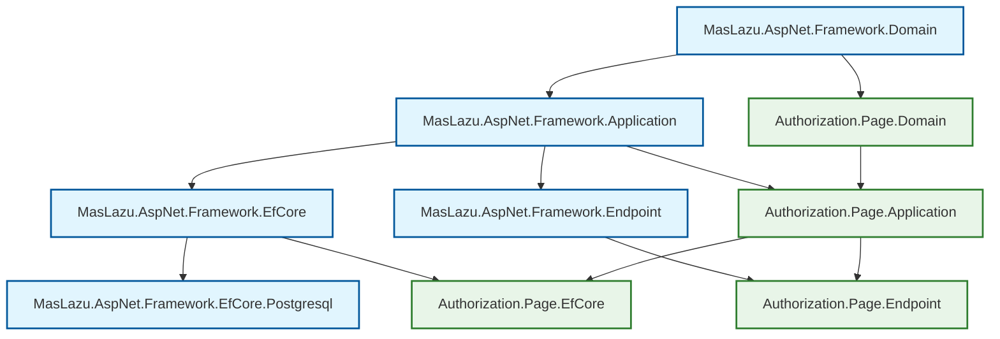

# Authorization Page

A comprehensive page-based authorization system for implementing UI-level access control. Provides hierarchical page management, page grouping, and permission-based navigation security. Built with .NET 9 and following clean architecture principles.

## 🚀 Overview

The Authorization Page module enables organizations to control access to UI pages and navigation elements. It provides a hierarchical structure for organizing pages, grouping them logically, and associating permissions for fine-grained access control.

## 📊 Dependency Graph



**Dependency Hierarchy:**

- **Framework Layer** (Blue): Provides foundational components
- **Authorization Page** (Green): Page-based authorization system

**Key Dependencies:**

- Built on Framework components for architecture patterns
- Uses EfCore.Postgresql for database operations
- Integrates with Framework.Endpoint for API functionality

## ✨ Key Features

- **Hierarchical Page Structure**: Parent-child relationships for page organization
- **Page Grouping**: Logical grouping with icons and descriptions
- **Permission-Based Access**: Associate permissions with pages for access control
- **Full CRUD Operations**: Complete management for pages, groups, and permissions
- **Clean Architecture**: Follows hexagonal architecture with clear separation of concerns
- **FluentValidation**: Comprehensive validation for all operations
- **Entity Framework Core**: Modern ORM with PostgreSQL support
- **FastEndpoints Integration**: High-performance API endpoints
- **Comprehensive Testing**: Extensive unit test coverage with xUnit

## 📦 Installation

### Package References

Add the following packages to your project:

```xml
<!-- Core Page Authorization functionality -->
<PackageReference Include="MasLazu.AspNet.Authorization.Page" Version="1.0.0" />

<!-- Entity Framework Core integration -->
<PackageReference Include="MasLazu.AspNet.Authorization.Page.EfCore" Version="1.0.0" />

<!-- API endpoints -->
<PackageReference Include="MasLazu.AspNet.Authorization.Page.Endpoint" Version="1.0.0" />

<!-- Framework dependencies -->
<PackageReference Include="MasLazu.AspNet.Framework.Application" Version="1.0.0" />
<PackageReference Include="MasLazu.AspNet.Framework.EfCore.Postgresql" Version="1.0.0" />
```

### Service Registration

Configure the services in your `Program.cs`:

```csharp
using MasLazu.AspNet.Authorization.Page.Extensions;
using MasLazu.AspNet.Authorization.Page.EfCore.Extensions;
using MasLazu.AspNet.Authorization.Page.Endpoint.Extensions;

var builder = WebApplication.CreateBuilder(args);

// Add Framework services
builder.Services.AddFrameworkApplication();
builder.Services.AddFrameworkEfCorePostgresql(
    builder.Configuration.GetConnectionString("DefaultConnection")!);

// Add Authorization Page services
builder.Services.AddAuthorizationPageApplication();
builder.Services.AddAuthorizationPageEntityFrameworkCore();
builder.Services.AddAuthorizationPageEndpoints();

// Configure database context
builder.Services.AddDbContext<AuthorizationPageDbContext>(options =>
    options.UseNpgsql(builder.Configuration.GetConnectionString("DefaultConnection")));

var app = builder.Build();

// Configure endpoints
app.UseAuthorizationPageEndpoints();

app.Run();
```

## 🏗️ Core Concepts

### Entities

#### Page

Represents a UI page with hierarchical structure and navigation information.

```csharp
public class Page : BaseEntity
{
    public Guid? ParentId { get; set; }
    public Guid? PageGroupId { get; set; }
    public string Code { get; set; } = string.Empty;
    public string Name { get; set; } = string.Empty;
    public string Path { get; set; } = string.Empty;

    public Page? Parent { get; set; }
    public PageGroup? PageGroup { get; set; }
    public ICollection<PagePermission>? PagePermissions { get; set; }
}
```

**Properties:**

- `ParentId`: Reference to parent page for hierarchical structure
- `PageGroupId`: Reference to page group for organization
- `Code`: Unique code identifier for the page
- `Name`: Human-readable page name
- `Path`: URL path or route for the page
- `Parent`: Navigation property to parent page
- `PageGroup`: Navigation property to page group
- `PagePermissions`: Collection of associated permissions

#### PageGroup

Organizes pages into logical groups for navigation and management.

```csharp
public class PageGroup : BaseEntity
{
    public string Code { get; set; } = string.Empty;
    public string Name { get; set; } = string.Empty;
    public string? Icon { get; set; }

    public ICollection<Page>? Pages { get; set; }
}
```

**Properties:**

- `Code`: Unique code identifier for the group
- `Name`: Human-readable group name
- `Icon`: Optional icon identifier for UI display
- `Pages`: Collection of pages in this group

#### PagePermission

Links pages to permissions for access control.

```csharp
public class PagePermission : BaseEntity
{
    public Guid PageId { get; set; }
    public Guid PermissionId { get; set; }

    public Page? Page { get; set; }
}
```

**Properties:**

- `PageId`: Reference to the page
- `PermissionId`: Reference to the permission required for access
- `Page`: Navigation property to the page entity

### Data Transfer Objects

#### PageDto

```csharp
public record PageDto(
    Guid Id,
    Guid? ParentId,
    Guid? PageGroupId,
    string Code,
    string Name,
    string Path,
    DateTimeOffset CreatedAt,
    DateTimeOffset? UpdatedAt
) : BaseDto(Id, CreatedAt, UpdatedAt);
```

#### PageGroupDto

```csharp
public record PageGroupDto(
    Guid Id,
    string Code,
    string Name,
    string? Icon,
    DateTimeOffset CreatedAt,
    DateTimeOffset? UpdatedAt
) : BaseDto(Id, CreatedAt, UpdatedAt);
```

#### PagePermissionDto

```csharp
public record PagePermissionDto(
    Guid Id,
    Guid PageId,
    Guid PermissionId,
    DateTimeOffset CreatedAt,
    DateTimeOffset? UpdatedAt
) : BaseDto(Id, CreatedAt, UpdatedAt);
```

#### Create/Update Requests

```csharp
public record CreatePageRequest(
    Guid? ParentId,
    Guid? PageGroupId,
    string Code,
    string Name,
    string Path
);

public record CreatePageGroupRequest(
    string Code,
    string Name,
    string? Icon
);

public record CreatePagePermissionRequest(
    Guid PageId,
    Guid PermissionId
);
```

## 🛠️ API Reference

### Page Management Endpoints

#### Create Page

```http
POST /api/v1/pages
Content-Type: application/json

{
  "parentId": "550e8400-e29b-41d4-a716-446655440000",
  "pageGroupId": "660e8400-e29b-41d4-a716-446655440001",
  "code": "USER_PROFILE",
  "name": "User Profile",
  "path": "/users/profile"
}
```

**Response:**

```json
{
  "id": "770e8400-e29b-41d4-a716-446655440002",
  "parentId": "550e8400-e29b-41d4-a716-446655440000",
  "pageGroupId": "660e8400-e29b-41d4-a716-446655440001",
  "code": "USER_PROFILE",
  "name": "User Profile",
  "path": "/users/profile",
  "createdAt": "2024-01-15T10:30:00Z",
  "updatedAt": null
}
```

#### Get Pages (Paginated)

```http
POST /api/v1/pages/paginated?page=1&pageSize=10
Content-Type: application/json

{
  "filters": {},
  "sorts": [
    {
      "field": "name",
      "direction": "asc"
    }
  ]
}
```

#### Get Page by ID

```http
GET /api/v1/pages/{id}
```

#### Update Page

```http
PUT /api/v1/pages/{id}
Content-Type: application/json

{
  "parentId": "550e8400-e29b-41d4-a716-446655440000",
  "pageGroupId": "660e8400-e29b-41d4-a716-446655440001",
  "code": "USER_PROFILE_EDIT",
  "name": "Edit User Profile",
  "path": "/users/profile/edit"
}
```

#### Delete Page

```http
DELETE /api/v1/pages/{id}
```

### Page Group Management Endpoints

#### Create Page Group

```http
POST /api/v1/page-groups
Content-Type: application/json

{
  "code": "USER_MANAGEMENT",
  "name": "User Management",
  "icon": "users"
}
```

#### Get Page Groups (Paginated)

```http
POST /api/v1/page-groups/paginated?page=1&pageSize=10
```

#### Get Page Group by ID

```http
GET /api/v1/page-groups/{id}
```

#### Update Page Group

```http
PUT /api/v1/page-groups/{id}
Content-Type: application/json

{
  "code": "USER_MANAGEMENT",
  "name": "User Administration",
  "icon": "user-cog"
}
```

#### Delete Page Group

```http
DELETE /api/v1/page-groups/{id}
```

### Page Permission Management Endpoints

#### Create Page Permission

```http
POST /api/v1/page-permissions
Content-Type: application/json

{
  "pageId": "770e8400-e29b-41d4-a716-446655440002",
  "permissionId": "880e8400-e29b-41d4-a716-446655440003"
}
```

#### Get Page Permissions (Paginated)

```http
POST /api/v1/page-permissions/paginated?page=1&pageSize=10
```

#### Get Page Permission by ID

```http
GET /api/v1/page-permissions/{id}
```

#### Update Page Permission

```http
PUT /api/v1/page-permissions/{id}
Content-Type: application/json

{
  "pageId": "770e8400-e29b-41d4-a716-446655440002",
  "permissionId": "990e8400-e29b-41d4-a716-446655440004"
}
```

#### Delete Page Permission

```http
DELETE /api/v1/page-permissions/{id}
```

## 💻 Usage Examples

### Basic Page Management

```csharp
// Inject the page service
private readonly IPageService _pageService;
private readonly IPageGroupService _pageGroupService;
private readonly IPagePermissionService _pagePermissionService;

// Create a page group
var groupRequest = new CreatePageGroupRequest("ADMIN", "Administration", "shield");
var pageGroup = await _pageGroupService.CreateAsync(groupRequest);

// Create a page
var pageRequest = new CreatePageRequest(
    null, // no parent
    pageGroup.Id,
    "USER_LIST",
    "User List",
    "/admin/users"
);
var page = await _pageService.CreateAsync(pageRequest);

// Assign permission to page
var permissionRequest = new CreatePagePermissionRequest(page.Id, permissionId);
await _pagePermissionService.CreateAsync(permissionRequest);
```

### Hierarchical Page Structure

```csharp
public class PageHierarchyService
{
    private readonly IPageService _pageService;

    public async Task CreatePageHierarchyAsync()
    {
        // Create parent page
        var parentPage = await _pageService.CreateAsync(new CreatePageRequest(
            null,
            groupId,
            "DASHBOARD",
            "Dashboard",
            "/dashboard"
        ));

        // Create child pages
        var childPage1 = await _pageService.CreateAsync(new CreatePageRequest(
            parentPage.Id,
            groupId,
            "ANALYTICS",
            "Analytics",
            "/dashboard/analytics"
        ));

        var childPage2 = await _pageService.CreateAsync(new CreatePageRequest(
            parentPage.Id,
            groupId,
            "REPORTS",
            "Reports",
            "/dashboard/reports"
        ));
    }
}
```

### Access Control Integration

```csharp
public class PageAccessControlService
{
    private readonly IPageService _pageService;
    private readonly IPermissionService _permissionService;

    public async Task<bool> HasPageAccessAsync(Guid userId, string pageCode)
    {
        // Get page by code
        var page = await GetPageByCodeAsync(pageCode);
        if (page == null) return false;

        // Get page permissions
        var pagePermissions = await GetPagePermissionsAsync(page.Id);

        // Check if user has any of the required permissions
        foreach (var pagePermission in pagePermissions)
        {
            if (await _permissionService.UserHasPermissionAsync(userId, pagePermission.PermissionId))
            {
                return true;
            }
        }

        return false;
    }
}
```

### Navigation Menu Building

```csharp
public class NavigationService
{
    private readonly IPageService _pageService;
    private readonly IPageGroupService _pageGroupService;

    public async Task<IEnumerable<NavigationItem>> GetUserNavigationAsync(Guid userId)
    {
        var pageGroups = await _pageGroupService.GetAllAsync();
        var accessiblePages = new List<NavigationItem>();

        foreach (var group in pageGroups)
        {
            var groupPages = await GetAccessiblePagesForGroupAsync(userId, group.Id);
            if (groupPages.Any())
            {
                accessiblePages.Add(new NavigationItem
                {
                    Group = group,
                    Pages = groupPages
                });
            }
        }

        return accessiblePages;
    }

    private async Task<IEnumerable<PageDto>> GetAccessiblePagesForGroupAsync(Guid userId, Guid groupId)
    {
        // Implementation to filter pages user can access
        var allPages = await _pageService.GetByPageGroupIdAsync(groupId);
        var accessiblePages = new List<PageDto>();

        foreach (var page in allPages)
        {
            if (await HasPageAccessAsync(userId, page.Id))
            {
                accessiblePages.Add(page);
            }
        }

        return accessiblePages;
    }
}
```

## 🔧 Configuration

### Database Configuration

```csharp
// appsettings.json
{
  "ConnectionStrings": {
    "DefaultConnection": "Host=localhost;Database=MyApp;Username=myuser;Password=mypass"
  }
}
```

### Validation Configuration

FluentValidation rules are automatically registered:

```csharp
// Custom validation can be added
public class CustomPageValidator : AbstractValidator<CreatePageRequest>
{
    public CustomPageValidator()
    {
        RuleFor(x => x.Code)
            .NotEmpty()
            .MaximumLength(50)
            .Must(BeUniquePageCode).WithMessage("Page code must be unique");

        RuleFor(x => x.Name)
            .NotEmpty()
            .MaximumLength(100);

        RuleFor(x => x.Path)
            .NotEmpty()
            .MaximumLength(500)
            .Must(BeValidPath).WithMessage("Invalid path format");
    }

    private bool BeUniquePageCode(string code) => true; // Implementation
    private bool BeValidPath(string path) => true; // Implementation
}
```

## 🏗️ Project Structure

```
src/
├── MasLazu.AspNet.Authorization.Page.Abstraction/
│   ├── Interfaces/           # Service interfaces
│   └── Models/              # DTOs and request/response models
├── MasLazu.AspNet.Authorization.Page.Domain/
│   └── Entities/            # Domain entities (Page, PageGroup, PagePermission)
├── MasLazu.AspNet.Authorization.Page/
│   ├── Extensions/          # Service registration extensions
│   ├── Services/            # Business logic implementations
│   ├── Utils/               # Utility classes
│   └── Validators/          # FluentValidation validators
├── MasLazu.AspNet.Authorization.Page.EfCore/
│   ├── Configurations/      # Entity configurations
│   ├── Data/               # DbContext and repositories
│   └── Extensions/         # EF Core service registration
└── MasLazu.AspNet.Authorization.Page.Endpoint/
    ├── EndpointGroups/     # Endpoint grouping
    ├── Endpoints/          # FastEndpoints implementations
    └── Extensions/         # Endpoint registration

test/
├── MasLazu.AspNet.Authorization.Page.Test/
├── MasLazu.AspNet.Authorization.Page.EfCore.Test/
└── MasLazu.AspNet.Authorization.Page.Endpoint.Test/
```

## 🧪 Testing

The module includes comprehensive test coverage:

```bash
# Run all tests
dotnet test

# Run with coverage
dotnet test --collect:"XPlat Code Coverage"

# Run specific test project
dotnet test test/MasLazu.AspNet.Authorization.Page.Test/
```

### Test Categories

- **Unit Tests**: Business logic and validation testing
- **Integration Tests**: Database and API endpoint testing
- **Repository Tests**: Data access layer testing
- **Endpoint Tests**: API endpoint behavior testing

## 🔗 Integration Examples

### With Authorization Core

```csharp
// Integration with Authorization.Core for permission validation
public class PageAuthorizationService
{
    private readonly IPagePermissionService _pagePermissionService;
    private readonly IPermissionService _permissionService;

    public async Task<bool> CanAccessPageAsync(Guid userId, Guid pageId)
    {
        var pagePermissions = await _pagePermissionService.GetByPageIdAsync(pageId);

        foreach (var pagePermission in pagePermissions)
        {
            if (await _permissionService.UserHasPermissionAsync(userId, pagePermission.PermissionId))
            {
                return true;
            }
        }

        return false;
    }
}
```

### With ASP.NET Core MVC

```csharp
// Page authorization filter for MVC
public class PageAuthorizeFilter : IAuthorizationFilter
{
    private readonly IPageAuthorizationService _pageAuthService;

    public PageAuthorizeFilter(IPageAuthorizationService pageAuthService)
    {
        _pageAuthService = pageAuthService;
    }

    public void OnAuthorization(AuthorizationFilterContext context)
    {
        var userId = GetCurrentUserId(context.HttpContext);
        var pageCode = GetPageCodeFromRoute(context.RouteData);

        if (!string.IsNullOrEmpty(pageCode))
        {
            var hasAccess = _pageAuthService.CanAccessPageAsync(userId, pageCode).Result;
            if (!hasAccess)
            {
                context.Result = new ForbidResult();
            }
        }
    }
}
```

## 🚀 Performance Considerations

- **Indexing**: Database indexes on frequently queried fields (codes, paths, foreign keys)
- **Pagination**: All list operations support efficient pagination
- **Caching**: Consider implementing caching for frequently accessed page structures
- **Bulk Operations**: Support for bulk permission assignments
- **Async Operations**: All operations are asynchronous for better scalability

## 🔒 Security Features

- **Hierarchical Access**: Parent page access doesn't automatically grant child page access
- **Permission Validation**: Strict permission checking for all page access
- **Audit Trail**: All entities inherit from BaseEntity with audit fields
- **Input Validation**: Comprehensive validation using FluentValidation
- **SQL Injection Protection**: Parameterized queries through Entity Framework Core

## 📚 Related Documentation

- [Authorization Core](./authorization-core.md) - Base authorization system
- [Framework Application](../framework/application.md) - Application layer patterns
- [Framework EF Core](../framework/efcore.md) - Data access patterns
- [FastEndpoints](../framework/endpoint.md) - API endpoint patterns

## 🤝 Contributing

Contributions are welcome! Please ensure:

1. All tests pass
2. Code follows the established patterns
3. Documentation is updated
4. Security best practices are followed
5. FluentValidation rules are comprehensive

## 📄 License

This project is licensed under the MIT License - see the [LICENSE](../../../LICENSE) file for details.
