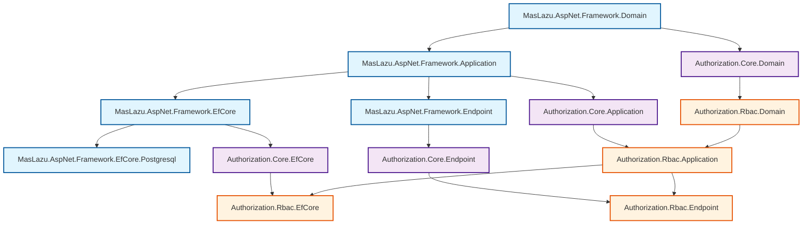

# Authorization RBAC

A comprehensive Role-Based Access Control (RBAC) system that extends the Authorization Core with role management capabilities. Built with .NET 9 and following clean architecture principles.

## 🚀 Overview

The Authorization RBAC module provides a complete role-based access control system that builds upon the Authorization Core foundation. It enables organizations to manage user access through roles, where users are assigned roles and roles are granted specific permissions.

## 📊 Dependency Graph



**Dependency Hierarchy:**

- **Framework Layer** (Blue): Provides foundational components
- **Authorization Core** (Purple): Core authorization system with permissions
- **Authorization RBAC** (Orange): Role-based access control extension

**Key Dependencies:**

- Requires Authorization.Core for permission management
- Built on Framework components for architecture patterns
- Uses EfCore.Postgresql for database operations
- Integrates with Framework.Endpoint for API functionality

## ✨ Key Features

- **Complete Role Management**: Full CRUD operations for roles with validation
- **Role-Permission Assignment**: Link roles to specific permissions from Authorization Core
- **User-Role Management**: Assign and manage user roles with audit tracking
- **Clean Architecture**: Follows hexagonal architecture with clear separation of concerns
- **FluentValidation**: Comprehensive validation for all operations
- **Entity Framework Core**: Modern ORM with PostgreSQL support
- **FastEndpoints Integration**: High-performance API endpoints
- **Comprehensive Testing**: Extensive unit test coverage with xUnit
- **Dependency Injection**: Full DI container support

## 📦 Installation

### Package References

Add the following packages to your project:

```xml
<!-- Core RBAC functionality -->
<PackageReference Include="MasLazu.AspNet.Authorization.Rbac" Version="1.0.0" />

<!-- Entity Framework Core integration -->
<PackageReference Include="MasLazu.AspNet.Authorization.Rbac.EfCore" Version="1.0.0" />

<!-- API endpoints -->
<PackageReference Include="MasLazu.AspNet.Authorization.Rbac.Endpoint" Version="1.0.0" />

<!-- Required dependency: Authorization Core -->
<PackageReference Include="MasLazu.AspNet.Authorization.Core" Version="1.0.0" />
```

### Service Registration

Configure the services in your `Program.cs`:

```csharp
using MasLazu.AspNet.Authorization.Rbac.Extensions;
using MasLazu.AspNet.Authorization.Rbac.EfCore.Extensions;
using MasLazu.AspNet.Authorization.Rbac.Endpoint.Extensions;

var builder = WebApplication.CreateBuilder(args);

// Add Authorization Core (required dependency)
builder.Services.AddAuthorizationCoreApplication();
builder.Services.AddAuthorizationCoreEntityFrameworkCore();

// Add Authorization RBAC services
builder.Services.AddAuthorizationRbacApplication();
builder.Services.AddAuthorizationRbacEntityFrameworkCore();
builder.Services.AddAuthorizationRbacEndpoints();

// Configure database context
builder.Services.AddDbContext<AuthorizationRbacDbContext>(options =>
    options.UseNpgsql(builder.Configuration.GetConnectionString("DefaultConnection")));

var app = builder.Build();

// Configure endpoints
app.UseAuthorizationRbacEndpoints();

app.Run();
```

## 🏗️ Core Concepts

### Entities

#### Role

Represents a named collection of permissions within the system.

```csharp
public class Role : BaseEntity
{
    public string Name { get; set; } = string.Empty;
    public string? Description { get; set; }
}
```

**Properties:**

- `Name`: Unique role identifier (e.g., "Administrator", "Manager", "User")
- `Description`: Optional role description for documentation

#### RolePermission

Links roles to specific permissions from the Authorization Core system.

```csharp
public class RolePermission : BaseEntity
{
    public Guid PermissionId { get; set; }
    public Guid RoleId { get; set; }
    public Role? Role { get; set; }
}
```

**Properties:**

- `PermissionId`: Reference to permission from Authorization Core
- `RoleId`: Reference to the role being granted the permission
- `Role`: Navigation property to the role entity

#### UserRole

Assigns roles to users with audit tracking.

```csharp
public class UserRole : BaseEntity
{
    public Guid UserId { get; set; }
    public Guid RoleId { get; set; }
    public Role? Role { get; set; }
}
```

**Properties:**

- `UserId`: Reference to the user being assigned the role
- `RoleId`: Reference to the role being assigned
- `Role`: Navigation property to the role entity

### Data Transfer Objects

#### RoleDto

```csharp
public record RoleDto(
    Guid Id,
    string Name,
    string? Description,
    DateTimeOffset CreatedAt,
    DateTimeOffset? UpdatedAt
) : BaseDto(Id, CreatedAt, UpdatedAt);
```

#### Create/Update Requests

```csharp
public record CreateRoleRequest(
    string Name,
    string? Description
);

public record UpdateRoleRequest(
    string Name,
    string? Description
);
```

## 🛠️ API Reference

### Role Management Endpoints

#### Create Role

```http
POST /api/roles
Content-Type: application/json

{
  "name": "Manager",
  "description": "Middle management role with departmental access"
}
```

**Response:**

```json
{
  "id": "550e8400-e29b-41d4-a716-446655440000",
  "name": "Manager",
  "description": "Middle management role with departmental access",
  "createdAt": "2024-01-15T10:30:00Z",
  "updatedAt": null
}
```

#### Get Roles (Paginated)

```http
GET /api/roles?page=1&pageSize=10
```

**Response:**

```json
{
  "items": [
    {
      "id": "550e8400-e29b-41d4-a716-446655440000",
      "name": "Administrator",
      "description": "Full system access",
      "createdAt": "2024-01-15T10:30:00Z",
      "updatedAt": null
    }
  ],
  "totalCount": 25,
  "page": 1,
  "pageSize": 10
}
```

#### Get Role by ID

```http
GET /api/roles/{id}
```

#### Update Role

```http
PUT /api/roles/{id}
Content-Type: application/json

{
  "name": "Senior Manager",
  "description": "Updated role description"
}
```

#### Delete Role

```http
DELETE /api/roles/{id}
```

### Role-Permission Management

#### Assign Permission to Role

```http
POST /api/role-permissions
Content-Type: application/json

{
  "roleId": "550e8400-e29b-41d4-a716-446655440000",
  "permissionId": "660e8400-e29b-41d4-a716-446655440001"
}
```

#### Get Role Permissions

```http
GET /api/role-permissions?roleId={roleId}&page=1&pageSize=10
```

#### Remove Permission from Role

```http
DELETE /api/role-permissions/{id}
```

### User-Role Management

#### Assign Role to User

```http
POST /api/user-roles
Content-Type: application/json

{
  "userId": "770e8400-e29b-41d4-a716-446655440002",
  "roleId": "550e8400-e29b-41d4-a716-446655440000"
}
```

#### Get User Roles

```http
GET /api/user-roles?userId={userId}&page=1&pageSize=10
```

#### Remove Role from User

```http
DELETE /api/user-roles/{id}
```

## 💻 Usage Examples

### Basic Role Management

```csharp
// Inject the role service
public class RoleManagementService
{
    private readonly IRoleCrudService _roleCrudService;

    public RoleManagementService(IRoleCrudService roleCrudService)
    {
        _roleCrudService = roleCrudService;
    }

    public async Task<RoleDto> CreateRoleAsync(CreateRoleRequest request)
    {
        // Validation is handled automatically by FluentValidation
        return await _roleCrudService.CreateAsync(request);
    }

    public async Task<PaginatedResult<RoleDto>> GetRolesAsync(PaginationRequest request)
    {
        return await _roleCrudService.GetPaginatedAsync(request);
    }
}
```

### Role-Permission Assignment

```csharp
public class RolePermissionService
{
    private readonly IRolePermissionCrudService _rolePermissionService;

    public RolePermissionService(IRolePermissionCrudService rolePermissionService)
    {
        _rolePermissionService = rolePermissionService;
    }

    public async Task AssignPermissionToRoleAsync(Guid roleId, Guid permissionId)
    {
        var request = new CreateRolePermissionRequest(roleId, permissionId);
        await _rolePermissionService.CreateAsync(request);
    }

    public async Task<IEnumerable<RolePermissionDto>> GetRolePermissionsAsync(Guid roleId)
    {
        var filter = new RolePermissionFilter { RoleId = roleId };
        var paginatedResult = await _rolePermissionService.GetPaginatedAsync(
            new PaginationRequest { Page = 1, PageSize = 100 },
            filter
        );
        return paginatedResult.Items;
    }
}
```

### User Role Management

```csharp
public class UserRoleService
{
    private readonly IUserRoleCrudService _userRoleService;

    public UserRoleService(IUserRoleCrudService userRoleService)
    {
        _userRoleService = userRoleService;
    }

    public async Task AssignRoleToUserAsync(Guid userId, Guid roleId)
    {
        var request = new CreateUserRoleRequest(userId, roleId);
        await _userRoleService.CreateAsync(request);
    }

    public async Task<IEnumerable<UserRoleDto>> GetUserRolesAsync(Guid userId)
    {
        var filter = new UserRoleFilter { UserId = userId };
        var paginatedResult = await _userRoleService.GetPaginatedAsync(
            new PaginationRequest { Page = 1, PageSize = 50 },
            filter
        );
        return paginatedResult.Items;
    }
}
```

## 🔧 Configuration

### Database Configuration

The module uses Entity Framework Core with PostgreSQL:

```csharp
// appsettings.json
{
  "ConnectionStrings": {
    "DefaultConnection": "Host=localhost;Database=MyApp;Username=myuser;Password=mypass"
  }
}
```

### Validation Configuration

FluentValidation rules are automatically registered:

```csharp
// Custom validation can be added
public class CustomRoleValidator : AbstractValidator<CreateRoleRequest>
{
    public CustomRoleValidator()
    {
        RuleFor(x => x.Name)
            .NotEmpty()
            .MaximumLength(100)
            .Must(BeUniqueRoleName).WithMessage("Role name must be unique");

        RuleFor(x => x.Description)
            .MaximumLength(500);
    }

    private bool BeUniqueRoleName(string name)
    {
        // Custom validation logic
        return true;
    }
}
```

## 🏗️ Project Structure

```
src/
├── MasLazu.AspNet.Authorization.Rbac.Abstraction/
│   ├── Interfaces/           # Service interfaces
│   └── Models/              # DTOs and request/response models
├── MasLazu.AspNet.Authorization.Rbac.Domain/
│   └── Entities/            # Domain entities (Role, RolePermission, UserRole)
├── MasLazu.AspNet.Authorization.Rbac/
│   ├── Extensions/          # Service registration extensions
│   ├── Services/            # Business logic implementations
│   ├── Utils/               # Utility classes
│   └── Validators/          # FluentValidation validators
├── MasLazu.AspNet.Authorization.Rbac.EfCore/
│   ├── Configurations/      # Entity configurations
│   ├── Data/               # DbContext and repositories
│   └── Extensions/         # EF Core service registration
└── MasLazu.AspNet.Authorization.Rbac.Endpoint/
    ├── EndpointGroups/     # Endpoint grouping
    ├── Endpoints/          # FastEndpoints implementations
    └── Extensions/         # Endpoint registration

test/
├── MasLazu.AspNet.Authorization.Rbac.Test/
├── MasLazu.AspNet.Authorization.Rbac.EfCore.Test/
└── MasLazu.AspNet.Authorization.Rbac.Endpoint.Test/
```

## 🧪 Testing

The module includes comprehensive test coverage:

```bash
# Run all tests
dotnet test

# Run with coverage
dotnet test --collect:"XPlat Code Coverage"

# Run specific test project
dotnet test test/MasLazu.AspNet.Authorization.Rbac.Test/
```

### Test Categories

- **Unit Tests**: Business logic and validation testing
- **Integration Tests**: Database and API endpoint testing
- **Repository Tests**: Data access layer testing
- **Endpoint Tests**: API endpoint behavior testing

## 🔗 Integration with Authorization Core

The RBAC module seamlessly integrates with Authorization Core:

```csharp
// Check if user has permission through roles
public async Task<bool> UserHasPermissionAsync(Guid userId, string resource, string action)
{
    // Get user roles
    var userRoles = await GetUserRolesAsync(userId);

    // Get permissions for those roles
    var rolePermissions = await GetRolePermissionsAsync(userRoles.Select(r => r.RoleId));

    // Check if any role has the required permission
    return await _authorizationCore.HasPermissionAsync(rolePermissions, resource, action);
}
```

## 🚀 Performance Considerations

- **Pagination**: All list operations support efficient pagination
- **Indexing**: Database indexes on foreign keys and frequently queried fields
- **Caching**: Consider implementing caching for frequently accessed roles and permissions
- **Bulk Operations**: Support for bulk role assignments and updates

## 🔒 Security Features

- **Validation**: Comprehensive input validation using FluentValidation
- **Audit Trail**: All entities inherit from BaseEntity with audit fields
- **Soft Delete**: Support for soft delete operations
- **SQL Injection Protection**: Parameterized queries through Entity Framework Core

## 📚 Related Documentation

- [Authorization Core](./authorization-core.md) - Base authorization system
- [Framework Application](../framework/application.md) - Application layer patterns
- [Framework EF Core](../framework/efcore.md) - Data access patterns
- [FastEndpoints](../framework/endpoint.md) - API endpoint patterns

## 🤝 Contributing

Contributions are welcome! Please ensure:

1. All tests pass
2. Code follows the established patterns
3. Documentation is updated
4. FluentValidation rules are comprehensive

## 📄 License

This project is licensed under the MIT License - see the [LICENSE](../../../LICENSE) file for details.
