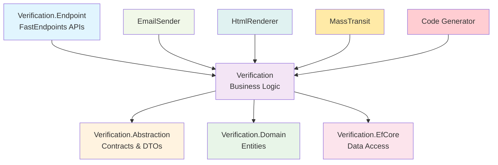
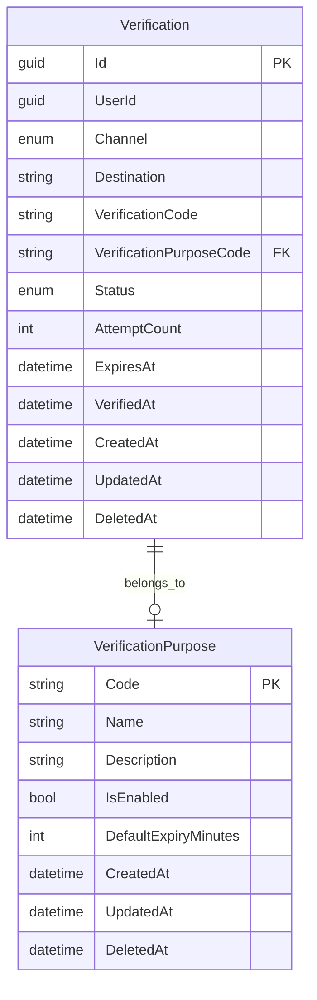

# Verification

A powerful verification system for handling email and SMS verification codes with secure generation, expiration management, and beautiful email templates. Built on MasLazu.AspNet Framework for enterprise-grade reliability.

## 🎯 Purpose

The Verification module provides comprehensive verification capabilities:

- **Multi-Channel Support** - Email, SMS, and extensible channels
- **Purpose-Based Verification** - Different verification types (registration, password reset, etc.)
- **Secure Code Generation** - Cryptographically secure verification codes
- **Expiration Management** - Configurable expiry times with automatic cleanup
- **Email Templates** - Beautiful, responsive HTML email templates
- **Event-Driven Architecture** - MassTransit integration for verification events

## 📦 Installation

```bash
# Core abstractions and interfaces
dotnet add package MasLazu.AspNet.Verification.Abstraction

# Business logic implementation
dotnet add package MasLazu.AspNet.Verification

# Domain entities
dotnet add package MasLazu.AspNet.Verification.Domain

# API endpoints
dotnet add package MasLazu.AspNet.Verification.Endpoint

# Database implementation
dotnet add package MasLazu.AspNet.Verification.EfCore
```

## 🏗️ Architecture Overview



## 🚀 Core Features

### 1. **Verification Service**

```csharp
public class VerificationService : CrudService<Verification, VerificationDto, CreateVerificationRequest, UpdateVerificationRequest>, IVerificationService
{
    public async Task<VerificationDto> SendVerificationAsync(
        Guid userId,
        SendVerificationRequest request,
        CancellationToken ct = default)
    {
        // Create verification record
        var verification = await CreateVerificationAsync(userId, new CreateVerificationRequest(
            UserId: request.UserId,
            Channel: VerificationChannel.Email,
            Destination: request.Destination,
            VerificationPurposeCode: request.PurposeCode,
            ExpiresAt: request.ExpiresAt ?? DateTimeOffset.UtcNow.AddMinutes(15)
        ), ct);

        // Send verification code via email
        await SendVerificationCodeAsync(verification, ct);

        return verification;
    }

    public async Task<VerificationDto> VerifyAsync(string code, CancellationToken ct = default)
    {
        // Find valid verification
        var verification = await ReadRepository.FirstOrDefaultAsync(v =>
            v.VerificationCode == code &&
            v.Status == VerificationStatus.Pending &&
            v.ExpiresAt > DateTimeOffset.UtcNow, ct);

        if (verification == null)
            throw new InvalidOperationException("Invalid or expired verification code");

        // Mark as verified
        verification.Status = VerificationStatus.Verified;
        verification.VerifiedAt = DateTimeOffset.UtcNow;
        verification.AttemptCount++;

        await Repository.UpdateAsync(verification, ct);
        await UnitOfWork.SaveChangesAsync(ct);

        // Publish verification completed event
        await _publishEndpoint.Publish(new VerificationCompletedEvent
        {
            VerificationId = verification.Id,
            UserId = verification.UserId,
            Email = verification.Destination,
            PurposeCode = verification.VerificationPurposeCode,
            CompletedAt = DateTime.UtcNow,
            IsSuccessful = true
        }, ct);

        return verification.Adapt<VerificationDto>();
    }
}
```

### 2. **Secure Code Generation**

```csharp
private string GenerateVerificationCode()
{
    // Generate cryptographically secure 6-digit code
    var random = new Random();
    return random.Next(100000, 999999).ToString();
}

// For enhanced security, you can implement:
private string GenerateSecureCode()
{
    using var rng = RandomNumberGenerator.Create();
    var bytes = new byte[4];
    rng.GetBytes(bytes);
    var number = BitConverter.ToUInt32(bytes, 0);
    return (number % 900000 + 100000).ToString();
}
```

### 3. **Email Templates**

```csharp
private async Task SendEmailVerificationAsync(VerificationDto verification, CancellationToken ct = default)
{
    var email = new EmailMessageBuilder()
        .To(verification.Destination)
        .Subject("🔐 Verify Your Account")
        .RenderOptions(new EmailRenderOptions
        {
            Theme = "VerificationCode", // Uses professional template
            CompanyName = "Your Company",
            PrimaryColor = "#28a745",
            LogoUrl = "https://yourapp.com/logo.png"
        })
        .Model(new
        {
            VerificationCode = verification.VerificationCode,
            UserName = "User", // Can be retrieved from user service
            ExpiryMinutes = (int)(verification.ExpiresAt - DateTimeOffset.UtcNow).TotalMinutes
        })
        .Build();

    await _emailSender.SendEmailAsync(email, _htmlRenderer);
}
```

## 📊 Domain Model

### Core Entities



### Verification Entity

```csharp
public class Verification : BaseEntity
{
    public Guid UserId { get; set; }
    public VerificationChannel Channel { get; set; } // Email, SMS, etc.
    public string Destination { get; set; } = string.Empty; // Email or phone number
    public string VerificationCode { get; set; } = string.Empty;
    public string VerificationPurposeCode { get; set; } = string.Empty; // registration, password_reset, etc.
    public VerificationStatus Status { get; set; } = VerificationStatus.Pending;
    public int AttemptCount { get; set; }
    public DateTimeOffset ExpiresAt { get; set; }
    public DateTimeOffset? VerifiedAt { get; set; }

    // Navigation properties
    public VerificationPurpose? VerificationPurpose { get; set; }
}

public enum VerificationChannel
{
    Email = 1,
    SMS = 2,
    WhatsApp = 3,
    Telegram = 4
}

public enum VerificationStatus
{
    Pending = 1,
    Verified = 2,
    Expired = 3,
    Failed = 4
}
```

## 🔧 Configuration & Setup

### 1. **Service Registration**

```csharp
// Program.cs
var builder = WebApplication.CreateBuilder(args);

// Verification services
builder.Services.AddVerificationServices();

// Email services (required for email verification)
builder.Services.AddEmailSenderGmail(builder.Configuration);
// OR
builder.Services.AddEmailSenderSendGrid(builder.Configuration);

// MassTransit for events
builder.Services.AddMassTransit(x =>
{
    x.UsingRabbitMq((context, cfg) =>
    {
        cfg.Host("localhost", "/", h =>
        {
            h.Username("guest");
            h.Password("guest");
        });
        cfg.ConfigureEndpoints(context);
    });
});

// Database
builder.Services.AddDbContext<VerificationDbContext>(options =>
    options.UseNpgsql(connectionString));

// Framework services
builder.Services.AddFrameworkApplication();
builder.Services.AddFrameworkEfCore();
```

### 2. **Email Configuration**

```json
{
  "EmailSender": {
    "Gmail": {
      "SmtpServer": "smtp.gmail.com",
      "Port": 587,
      "Username": "your-email@gmail.com",
      "Password": "your-app-password",
      "EnableSsl": true,
      "From": "noreply@yourapp.com",
      "FromName": "Your App"
    }
  }
}
```

### 3. **Verification Purposes Seeding**

```csharp
public class VerificationPurposeSeeder
{
    public static readonly VerificationPurpose[] DefaultPurposes =
    {
        new() { Code = "registration", Name = "User Registration", DefaultExpiryMinutes = 15 },
        new() { Code = "password_reset", Name = "Password Reset", DefaultExpiryMinutes = 30 },
        new() { Code = "email_change", Name = "Email Address Change", DefaultExpiryMinutes = 60 },
        new() { Code = "phone_verification", Name = "Phone Number Verification", DefaultExpiryMinutes = 10 },
        new() { Code = "two_factor_auth", Name = "Two-Factor Authentication", DefaultExpiryMinutes = 5 }
    };
}
```

## 🔌 API Endpoints

### Verification Endpoints

```http
# Verify a code
POST /api/v1/verification/verify
Content-Type: application/json

{
  "code": "123456"
}

# Response
{
  "data": {
    "id": "550e8400-e29b-41d4-a716-446655440000",
    "userId": "550e8400-e29b-41d4-a716-446655440001",
    "channel": "Email",
    "destination": "user@example.com",
    "verificationCode": "123456",
    "verificationPurposeCode": "registration",
    "status": "Verified",
    "attemptCount": 1,
    "expiresAt": "2025-09-18T10:30:00Z",
    "verifiedAt": "2025-09-18T10:15:00Z",
    "createdAt": "2025-09-18T10:00:00Z",
    "updatedAt": "2025-09-18T10:15:00Z"
  },
  "message": "Verification successful",
  "success": true
}
```

### CRUD Operations (Admin)

```http
# Get all verifications (paginated)
GET /api/v1/verification?page=1&pageSize=20&status=Pending
Authorization: Bearer {admin_token}

# Get verification by ID
GET /api/v1/verification/{id}
Authorization: Bearer {admin_token}

# Create verification purpose
POST /api/v1/verification-purposes
Authorization: Bearer {admin_token}
Content-Type: application/json

{
  "code": "email_confirmation",
  "name": "Email Confirmation",
  "description": "Confirm email address changes",
  "defaultExpiryMinutes": 30
}
```

## 🎯 Usage Examples

### 1. **Registration Flow**

```csharp
public class UserRegistrationService
{
    private readonly IVerificationService _verificationService;
    private readonly IUserService _userService;

    public async Task<UserDto> RegisterUserAsync(RegisterRequest request)
    {
        // Create user account
        var user = await _userService.CreateAsync(Guid.Empty, new CreateUserRequest
        {
            Name = request.Name,
            Email = request.Email,
            // ... other properties
        });

        // Send email verification
        await _verificationService.SendVerificationAsync(Guid.Empty, new SendVerificationRequest(
            UserId: user.Id,
            Destination: request.Email,
            PurposeCode: "registration"
        ));

        return user;
    }

    public async Task<bool> VerifyEmailAsync(string code)
    {
        try
        {
            var verification = await _verificationService.VerifyAsync(code);

            // Update user as verified
            await _userService.MarkEmailAsVerifiedAsync(verification.UserId);

            return true;
        }
        catch
        {
            return false;
        }
    }
}
```

### 2. **Password Reset Flow**

```csharp
public class PasswordResetService
{
    private readonly IVerificationService _verificationService;
    private readonly IUserService _userService;

    public async Task SendPasswordResetAsync(string email)
    {
        var user = await _userService.GetByEmailAsync(email);
        if (user == null)
            return; // Don't reveal if email exists

        await _verificationService.SendVerificationAsync(Guid.Empty, new SendVerificationRequest(
            UserId: user.Id,
            Destination: email,
            PurposeCode: "password_reset"
        ));
    }

    public async Task<bool> ResetPasswordAsync(string code, string newPassword)
    {
        var verification = await _verificationService.VerifyAsync(code);

        if (verification.VerificationPurposeCode != "password_reset")
            throw new InvalidOperationException("Invalid verification purpose");

        await _userService.UpdatePasswordAsync(verification.UserId, newPassword);
        return true;
    }
}
```

### 3. **Two-Factor Authentication**

```csharp
public class TwoFactorAuthService
{
    private readonly IVerificationService _verificationService;
    private readonly IAuthService _authService;

    public async Task SendTwoFactorCodeAsync(Guid userId, string email)
    {
        await _verificationService.SendVerificationAsync(userId, new SendVerificationRequest(
            UserId: userId,
            Destination: email,
            PurposeCode: "two_factor_auth",
            ExpiresAt: DateTimeOffset.UtcNow.AddMinutes(5) // Short expiry for 2FA
        ));
    }

    public async Task<LoginResponse> VerifyTwoFactorAsync(string code)
    {
        var verification = await _verificationService.VerifyAsync(code);

        if (verification.VerificationPurposeCode != "two_factor_auth")
            throw new InvalidOperationException("Invalid verification purpose");

        // Complete login process
        return await _authService.CompleteLoginAsync(verification.UserId);
    }
}
```

### 4. **Custom Email Templates**

```csharp
public class CustomVerificationService : VerificationService
{
    protected override async Task SendEmailVerificationAsync(VerificationDto verification, CancellationToken ct = default)
    {
        // Different templates based on purpose
        var template = verification.VerificationPurposeCode switch
        {
            "registration" => "WelcomeVerification",
            "password_reset" => "PasswordResetVerification",
            "two_factor_auth" => "SecurityVerification",
            _ => "VerificationCode"
        };

        var subject = verification.VerificationPurposeCode switch
        {
            "registration" => "🎉 Welcome! Verify your account",
            "password_reset" => "🔒 Reset your password",
            "two_factor_auth" => "🛡️ Security verification required",
            _ => "🔐 Verify your account"
        };

        var email = new EmailMessageBuilder()
            .To(verification.Destination)
            .Subject(subject)
            .RenderOptions(new EmailRenderOptions
            {
                Theme = template,
                CompanyName = "Your Company",
                PrimaryColor = GetColorForPurpose(verification.VerificationPurposeCode)
            })
            .Model(new
            {
                VerificationCode = verification.VerificationCode,
                Purpose = verification.VerificationPurpose?.Name ?? "Verification",
                ExpiryMinutes = (int)(verification.ExpiresAt - DateTimeOffset.UtcNow).TotalMinutes
            })
            .Build();

        await _emailSender.SendEmailAsync(email, _htmlRenderer);
    }
}
```

## 📁 Project Structure

```
MasLazu.AspNet.Verification/
├── src/
│   ├── MasLazu.AspNet.Verification.Abstraction/
│   │   ├── Interfaces/
│   │   │   ├── IVerificationService.cs
│   │   │   └── IVerificationPurposeService.cs
│   │   ├── Models/
│   │   │   ├── VerificationDto.cs
│   │   │   ├── CreateVerificationRequest.cs
│   │   │   └── SendVerificationRequest.cs
│   │   ├── Enums/
│   │   │   ├── VerificationChannel.cs
│   │   │   └── VerificationStatus.cs
│   │   └── Events/
│   │       └── VerificationCompletedEvent.cs
│   │
│   ├── MasLazu.AspNet.Verification.Domain/
│   │   ├── Entities/
│   │   │   ├── Verification.cs
│   │   │   └── VerificationPurpose.cs
│   │   └── MasLazu.AspNet.Verification.Domain.csproj
│   │
│   ├── MasLazu.AspNet.Verification/
│   │   ├── Services/
│   │   │   ├── VerificationService.cs
│   │   │   └── VerificationPurposeService.cs
│   │   ├── Utils/
│   │   │   └── VerificationEntityPropertyMap.cs
│   │   ├── Extensions/
│   │   │   └── VerificationServiceExtensions.cs
│   │   └── MasLazu.AspNet.Verification.csproj
│   │
│   ├── MasLazu.AspNet.Verification.Endpoint/
│   │   ├── Endpoints/
│   │   │   ├── VerifyEndpoint.cs
│   │   │   └── VerificationCrudEndpoints.cs
│   │   ├── Models/
│   │   │   └── VerifyRequest.cs
│   │   └── EndpointGroups/
│   │       └── VerificationEndpointGroup.cs
│   │
│   └── MasLazu.AspNet.Verification.EfCore/
│       ├── Data/
│       │   └── VerificationDbContext.cs
│       ├── Configurations/
│       │   ├── VerificationConfiguration.cs
│       │   └── VerificationPurposeConfiguration.cs
│       └── MasLazu.AspNet.Verification.EfCore.csproj
│
├── MasLazu.AspNet.Verification.sln
└── README.md
```

## 🔗 Dependencies

```xml
<!-- Core Framework -->
<PackageReference Include="MasLazu.AspNet.Framework.Application" />
<PackageReference Include="MasLazu.AspNet.Framework.Domain" />
<PackageReference Include="MasLazu.AspNet.Framework.EfCore" />

<!-- Email Services -->
<PackageReference Include="MasLazu.AspNet.EmailSender.Abstraction" />

<!-- Messaging -->
<PackageReference Include="MassTransit" />
<PackageReference Include="MassTransit.RabbitMQ" />

<!-- Validation & Mapping -->
<PackageReference Include="FluentValidation" />
<PackageReference Include="Mapster" />

<!-- Database -->
<PackageReference Include="Microsoft.EntityFrameworkCore" />
<PackageReference Include="Npgsql.EntityFrameworkCore.PostgreSQL" />
```

## ✅ Best Practices

### ✅ Do's

- **Use secure code generation** with cryptographic randomness
- **Set appropriate expiry times** based on verification purpose
- **Implement rate limiting** to prevent abuse
- **Use purpose-based verification** for different scenarios
- **Handle expired codes gracefully** with clear error messages
- **Clean up expired verifications** regularly

### ❌ Don'ts

- **Don't use predictable codes** (sequential, timestamp-based)
- **Don't set excessively long expiry times** (security risk)
- **Don't expose verification details** in error messages
- **Don't allow unlimited attempts** without rate limiting
- **Don't store verification codes in plain text** logs
- **Don't reuse verification codes** across different purposes

## 🔒 Security Considerations

### 1. **Code Generation**

```csharp
// Use cryptographically secure random number generation
private string GenerateSecureCode()
{
    using var rng = RandomNumberGenerator.Create();
    var bytes = new byte[4];
    rng.GetBytes(bytes);
    var number = BitConverter.ToUInt32(bytes, 0);
    return (number % 900000 + 100000).ToString(); // 6-digit code
}
```

### 2. **Rate Limiting**

```csharp
public class VerificationRateLimitService
{
    private readonly IMemoryCache _cache;

    public async Task<bool> CanSendVerificationAsync(string destination)
    {
        var key = $"verification_limit_{destination}";
        var count = _cache.Get<int>(key);

        if (count >= 5) // Max 5 attempts per hour
            return false;

        _cache.Set(key, count + 1, TimeSpan.FromHours(1));
        return true;
    }
}
```

### 3. **Input Validation**

```csharp
public class SendVerificationRequestValidator : AbstractValidator<SendVerificationRequest>
{
    public SendVerificationRequestValidator()
    {
        RuleFor(x => x.Destination)
            .NotEmpty()
            .EmailAddress()
            .When(x => x.PurposeCode.Contains("email"));

        RuleFor(x => x.PurposeCode)
            .NotEmpty()
            .Must(BeValidPurpose)
            .WithMessage("Invalid verification purpose");
    }
}
```

## 🎯 Performance Optimization

### 1. **Background Processing**

```csharp
public class VerificationBackgroundService : BackgroundService
{
    protected override async Task ExecuteAsync(CancellationToken stoppingToken)
    {
        while (!stoppingToken.IsCancellationRequested)
        {
            await CleanupExpiredVerificationsAsync();
            await Task.Delay(TimeSpan.FromHours(1), stoppingToken);
        }
    }

    private async Task CleanupExpiredVerificationsAsync()
    {
        var cutoff = DateTimeOffset.UtcNow.AddDays(-7);
        await _verificationService.DeleteExpiredAsync(cutoff);
    }
}
```

### 2. **Caching**

```csharp
public class CachedVerificationService : VerificationService
{
    private readonly IMemoryCache _cache;

    public override async Task<bool> IsCodeValidAsync(Guid userId, string code, CancellationToken ct = default)
    {
        var cacheKey = $"verification_validity_{code}";

        if (_cache.TryGetValue(cacheKey, out bool cachedResult))
            return cachedResult;

        var result = await base.IsCodeValidAsync(userId, code, ct);
        _cache.Set(cacheKey, result, TimeSpan.FromMinutes(1));

        return result;
    }
}
```

## 🎯 Next Steps

After implementing Verification:

1. **[EmailSender Utility](../utilities/emailsender.md)** - Advanced email functionality
2. **[Authentication.Core Integration](./authentication-core.md)** - User verification workflows
3. **[Performance Monitoring](../examples/monitoring.md)** - Track verification metrics

## 📚 Related Documentation

- [EmailSender Utility](../utilities/emailsender.md) - Email templates and sending
- [Framework Overview](../framework/overview.md) - Core framework concepts
- [Modules Overview](./overview.md) - Other available modules
