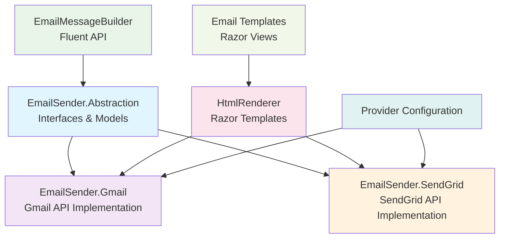
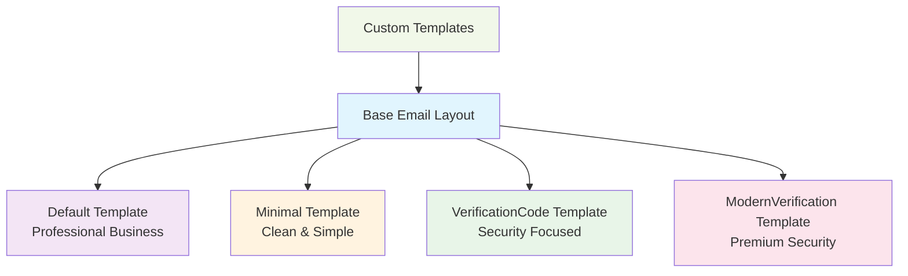

# EmailSender

A powerful, provider-agnostic email sending utility with beautiful HTML templates, Razor rendering, and support for multiple email providers including Gmail and SendGrid. Built for enterprise applications requiring professional email communications.

## 🎯 Purpose

The EmailSender utility provides comprehensive email functionality:

- **Multi-Provider Support** - Gmail API and SendGrid with unified interface
- **Beautiful HTML Templates** - Professional, responsive email templates
- **Razor Template Engine** - Dynamic content with C# models and Razor syntax
- **Fluent API** - Easy-to-use builder pattern for constructing emails
- **Rich Theming** - Customizable colors, logos, and branding
- **Enterprise Features** - Attachments, tracking, error handling

## 📦 Installation

```bash
# Core abstractions and builders
dotnet add package MasLazu.AspNet.EmailSender.Abstraction

# Gmail provider (Google Workspace/Gmail API)
dotnet add package MasLazu.AspNet.EmailSender.Gmail

# SendGrid provider (Cloud email service)
dotnet add package MasLazu.AspNet.EmailSender.SendGrid
```

## 🏗️ Architecture Overview



## 🚀 Core Features

### 1. **Fluent Email Builder**

```csharp
var email = new EmailMessageBuilder()
    .From("noreply@yourapp.com", "Your Company")
    .To("customer@example.com", "John Doe")
    .Cc("support@yourapp.com")
    .Subject("🎉 Welcome to Your Company!")
    .Body("Thank you for joining us!")
    .RenderOptions(new EmailRenderOptions
    {
        Theme = "Modern",
        CompanyName = "Your Company",
        LogoUrl = "https://yourapp.com/logo.png",
        PrimaryColor = "#3b82f6",
        SecondaryColor = "#1f2937"
    })
    .Model(new
    {
        UserName = "John",
        ActivationLink = "https://yourapp.com/activate/xyz"
    })
    .Build();

await _emailSender.SendEmailAsync(email, _htmlRenderer);
```

### 2. **Professional Email Templates**

#### Default Template

```csharp
var email = new EmailMessageBuilder()
    .To("user@example.com")
    .Subject("Account Update")
    .RenderOptions(new EmailRenderOptions
    {
        Theme = "Default", // Professional business template
        CompanyName = "Your Company",
        PrimaryColor = "#007bff"
    })
    .Model(new
    {
        UserName = "John",
        Message = "Your account has been successfully updated."
    })
    .Build();
```

#### Verification Code Template

```csharp
var email = new EmailMessageBuilder()
    .To("user@example.com")
    .Subject("🔐 Verify Your Account")
    .RenderOptions(new EmailRenderOptions
    {
        Theme = "VerificationCode", // Specialized security template
        CompanyName = "Your Company",
        PrimaryColor = "#28a745"
    })
    .Model(new
    {
        VerificationCode = "123456",
        UserName = "John",
        ExpiryMinutes = 15
    })
    .Build();
```

#### Modern Verification Template

```csharp
var email = new EmailMessageBuilder()
    .To("user@example.com")
    .Subject("🛡️ Security Verification")
    .RenderOptions(new EmailRenderOptions
    {
        Theme = "ModernVerification", // Premium security template
        CompanyName = "Your Company",
        LogoUrl = "https://yourapp.com/logo.png",
        PrimaryColor = "#6366f1"
    })
    .Model(new
    {
        VerificationCode = "987654",
        UserName = "John Smith",
        SecurityMessage = "We detected a login from a new device."
    })
    .Build();
```

### 3. **Multiple Provider Support**

#### Gmail Configuration

```csharp
// Program.cs
builder.Services.AddEmailSenderGmail(builder.Configuration);

// appsettings.json
{
  "Gmail": {
    "ServiceAccountCredentialsPath": "path/to/credentials.json",
    "ImpersonateEmail": "sender@yourdomain.com",
    "ApplicationName": "Your App Name",
    "DefaultFromEmail": "noreply@yourdomain.com",
    "DefaultFromName": "Your Company"
  }
}
```

#### SendGrid Configuration

```csharp
// Program.cs
builder.Services.AddEmailSenderSendGrid(builder.Configuration);

// appsettings.json
{
  "SendGrid": {
    "ApiKey": "your-sendgrid-api-key",
    "DefaultFromEmail": "noreply@yourdomain.com",
    "DefaultFromName": "Your Company",
    "SandboxMode": false,
    "EnableClickTracking": true,
    "EnableOpenTracking": true,
    "EnableSubscriptionTracking": true
  }
}
```

## 📊 Email Templates

### Template Hierarchy



### Template Features

#### 1. **Responsive Design**

```css
/* Mobile-first responsive templates */
@media (max-width: 600px) {
  .email-container {
    width: 100% !important;
    margin: 0 !important;
  }

  .email-content {
    padding: 20px 15px !important;
  }
}
```

#### 2. **Dark Mode Support**

```css
@media (prefers-color-scheme: dark) {
  .email-container {
    background-color: #1f2937 !important;
    color: #f9fafb !important;
  }
}
```

#### 3. **Custom Branding**

```csharp
var brandedEmail = new EmailMessageBuilder()
    .RenderOptions(new EmailRenderOptions
    {
        CompanyName = "TechCorp Inc.",
        LogoUrl = "https://techcorp.com/email-logo.png",
        PrimaryColor = "#ff6b35",     // Brand orange
        SecondaryColor = "#004643",   // Brand teal
        BackgroundColor = "#f7f8fc",  // Light background
        TextColor = "#2d3748",        // Dark text
        FontFamily = "Inter, sans-serif"
    })
    .Build();
```

## 🔧 Configuration & Setup

### 1. **Service Registration**

```csharp
// Program.cs
var builder = WebApplication.CreateBuilder(args);

// Choose your email provider
if (builder.Configuration.GetSection("Gmail").Exists())
{
    builder.Services.AddEmailSenderGmail(builder.Configuration);
}
else if (builder.Configuration.GetSection("SendGrid").Exists())
{
    builder.Services.AddEmailSenderSendGrid(builder.Configuration);
}

// Add Razor view engine for templates
builder.Services.AddControllersWithViews();
```

### 2. **Gmail Setup**

```bash
# 1. Create Google Cloud Project
# 2. Enable Gmail API
# 3. Create Service Account
# 4. Download credentials JSON file
# 5. Configure domain-wide delegation (for G Workspace)
```

```json
{
  "Gmail": {
    "ServiceAccountCredentialsPath": "credentials/gmail-service-account.json",
    "ImpersonateEmail": "sender@yourcompany.com",
    "ApplicationName": "Your App Email Service",
    "DefaultFromEmail": "noreply@yourcompany.com",
    "DefaultFromName": "Your Company",
    "EnableRetry": true,
    "MaxRetryAttempts": 3
  }
}
```

### 3. **SendGrid Setup**

```bash
# 1. Create SendGrid account
# 2. Generate API key
# 3. Verify sender identity
# 4. Configure domain authentication (optional)
```

```json
{
  "SendGrid": {
    "ApiKey": "SG.your-api-key-here",
    "DefaultFromEmail": "noreply@yourcompany.com",
    "DefaultFromName": "Your Company",
    "SandboxMode": false,
    "EnableClickTracking": true,
    "EnableOpenTracking": true,
    "EnableSubscriptionTracking": true,
    "EnableGoogleAnalytics": false,
    "Categories": ["transactional", "notifications"]
  }
}
```

## 🎯 Usage Examples

### 1. **Welcome Email**

```csharp
public class WelcomeEmailService
{
    private readonly IEmailSender _emailSender;
    private readonly IHtmlRenderer _htmlRenderer;

    public async Task SendWelcomeEmailAsync(User user, string activationLink)
    {
        var email = new EmailMessageBuilder()
            .From("welcome@yourapp.com", "Your App Team")
            .To(user.Email, user.Name)
            .Subject($"🎉 Welcome to Your App, {user.FirstName}!")
            .RenderOptions(new EmailRenderOptions
            {
                Theme = "Default",
                CompanyName = "Your App",
                LogoUrl = "https://yourapp.com/email-logo.png",
                PrimaryColor = "#3b82f6",
                IncludeSocialLinks = true,
                SocialLinks = new Dictionary<string, string>
                {
                    ["Twitter"] = "https://twitter.com/yourapp",
                    ["LinkedIn"] = "https://linkedin.com/company/yourapp"
                }
            })
            .Model(new
            {
                UserName = user.FirstName,
                ActivationLink = activationLink,
                SupportEmail = "support@yourapp.com",
                Features = new[]
                {
                    "Advanced analytics dashboard",
                    "Real-time collaboration tools",
                    "24/7 customer support"
                }
            })
            .Build();

        await _emailSender.SendEmailAsync(email, _htmlRenderer);
    }
}
```

### 2. **Order Confirmation**

```csharp
public class OrderEmailService
{
    public async Task SendOrderConfirmationAsync(Order order)
    {
        var email = new EmailMessageBuilder()
            .From("orders@yourstore.com", "Your Store")
            .To(order.Customer.Email, order.Customer.FullName)
            .Subject($"✅ Order Confirmation #{order.OrderNumber}")
            .RenderOptions(new EmailRenderOptions
            {
                Theme = "Default",
                CompanyName = "Your Store",
                PrimaryColor = "#059669"
            })
            .Model(new
            {
                OrderNumber = order.OrderNumber,
                CustomerName = order.Customer.FirstName,
                OrderDate = order.CreatedAt.ToString("MMMM dd, yyyy"),
                Total = order.Total.ToString("C"),
                Items = order.Items.Select(i => new
                {
                    Name = i.Product.Name,
                    Quantity = i.Quantity,
                    Price = i.Price.ToString("C")
                }),
                ShippingAddress = order.ShippingAddress,
                TrackingNumber = order.TrackingNumber
            })
            .Build();

        await _emailSender.SendEmailAsync(email, _htmlRenderer);
    }
}
```

### 3. **Password Reset**

```csharp
public class SecurityEmailService
{
    public async Task SendPasswordResetAsync(User user, string resetLink)
    {
        var email = new EmailMessageBuilder()
            .From("security@yourapp.com", "Your App Security")
            .To(user.Email, user.Name)
            .Subject("🔒 Password Reset Request")
            .RenderOptions(new EmailRenderOptions
            {
                Theme = "VerificationCode",
                CompanyName = "Your App",
                PrimaryColor = "#dc2626"
            })
            .Model(new
            {
                UserName = user.FirstName,
                ResetLink = resetLink,
                ExpiryHours = 24,
                SecurityTips = new[]
                {
                    "Use a strong, unique password",
                    "Enable two-factor authentication",
                    "Never share your password with others"
                }
            })
            .Build();

        await _emailSender.SendEmailAsync(email, _htmlRenderer);
    }
}
```

### 4. **Newsletter with Attachments**

```csharp
public class NewsletterService
{
    public async Task SendNewsletterAsync(IEnumerable<Subscriber> subscribers, byte[] pdfAttachment)
    {
        var attachment = new EmailAttachment
        {
            FileName = "monthly-report.pdf",
            Content = pdfAttachment,
            ContentType = "application/pdf"
        };

        foreach (var subscriber in subscribers)
        {
            var email = new EmailMessageBuilder()
                .From("newsletter@yourapp.com", "Your App Newsletter")
                .To(subscriber.Email, subscriber.Name)
                .Subject("📰 Your Monthly Newsletter - September 2025")
                .RenderOptions(new EmailRenderOptions
                {
                    Theme = "Default",
                    CompanyName = "Your App",
                    PrimaryColor = "#7c3aed"
                })
                .Model(new
                {
                    SubscriberName = subscriber.FirstName,
                    Articles = await GetLatestArticlesAsync(),
                    MonthlyStats = await GetMonthlyStatsAsync(),
                    UnsubscribeLink = $"https://yourapp.com/unsubscribe/{subscriber.Token}"
                })
                .Attachment(attachment)
                .Build();

            await _emailSender.SendEmailAsync(email, _htmlRenderer);
        }
    }
}
```

## 📁 Project Structure

```
MasLazu.AspNet.EmailSender/
├── src/
│   ├── MasLazu.AspNet.EmailSender.Abstraction/
│   │   ├── Interfaces/
│   │   │   ├── IEmailSender.cs
│   │   │   └── IHtmlRenderer.cs
│   │   ├── Models/
│   │   │   ├── EmailMessage.cs
│   │   │   ├── EmailAddress.cs
│   │   │   ├── EmailAttachment.cs
│   │   │   └── EmailRenderOptions.cs
│   │   ├── Builders/
│   │   │   └── EmailMessageBuilder.cs
│   │   └── MasLazu.AspNet.EmailSender.Abstraction.csproj
│   │
│   ├── MasLazu.AspNet.EmailSender.Gmail/
│   │   ├── Services/
│   │   │   └── GmailEmailService.cs
│   │   ├── Renderers/
│   │   │   └── GmailHtmlRenderer.cs
│   │   ├── Configuration/
│   │   │   └── GmailConfiguration.cs
│   │   ├── Views/
│   │   │   ├── Default.cshtml
│   │   │   ├── Minimal.cshtml
│   │   │   ├── VerificationCode.cshtml
│   │   │   └── ModernVerification.cshtml
│   │   ├── Extensions/
│   │   │   └── GmailServiceExtensions.cs
│   │   └── MasLazu.AspNet.EmailSender.Gmail.csproj
│   │
│   └── MasLazu.AspNet.EmailSender.SendGrid/
│       ├── Services/
│       │   └── SendGridEmailService.cs
│       ├── Renderers/
│       │   └── SendGridHtmlRenderer.cs
│       ├── Configuration/
│       │   └── SendGridConfiguration.cs
│       ├── Views/
│       │   ├── Default.cshtml
│       │   ├── Minimal.cshtml
│       │   ├── VerificationCode.cshtml
│       │   └── ModernVerification.cshtml
│       ├── Extensions/
│       │   └── SendGridServiceExtensions.cs
│       └── MasLazu.AspNet.EmailSender.SendGrid.csproj
│
├── MasLazu.AspNet.EmailSender.sln
└── README.md
```

## 🔗 Dependencies

```xml
<!-- Core Dependencies -->
<PackageReference Include="Microsoft.AspNetCore.Mvc.ViewFeatures" />
<PackageReference Include="Microsoft.AspNetCore.Mvc.Razor" />

<!-- Gmail Provider -->
<PackageReference Include="Google.Apis.Gmail.v1" />
<PackageReference Include="Google.Apis.Auth" />

<!-- SendGrid Provider -->
<PackageReference Include="SendGrid" />

<!-- Logging -->
<PackageReference Include="Microsoft.Extensions.Logging" />
<PackageReference Include="Microsoft.Extensions.Options" />
```

## ✅ Best Practices

### ✅ Do's

- **Use meaningful subject lines** with emojis for engagement
- **Implement proper error handling** and retry logic
- **Include unsubscribe links** for marketing emails
- **Test emails across different clients** (Gmail, Outlook, etc.)
- **Use responsive templates** for mobile compatibility
- **Implement rate limiting** to avoid provider limits
- **Monitor delivery rates** and bounce handling

### ❌ Don'ts

- **Don't hardcode email content** - use templates and models
- **Don't ignore email deliverability** best practices
- **Don't send emails without proper authentication** (SPF, DKIM)
- **Don't use misleading subject lines** or content
- **Don't forget to handle bounces** and unsubscribes
- **Don't send large attachments** - use cloud links instead

## 🔒 Security & Compliance

### 1. **Authentication Setup**

```bash
# SPF Record (Add to DNS)
TXT record: v=spf1 include:_spf.google.com include:sendgrid.net ~all

# DKIM Setup (Provider-specific)
# Gmail: Configure in Google Admin Console
# SendGrid: Configure in SendGrid dashboard

# DMARC Policy (Add to DNS)
TXT record: v=DMARC1; p=quarantine; rua=mailto:dmarc@yourcompany.com
```

### 2. **Rate Limiting**

```csharp
public class RateLimitedEmailService : IEmailSender
{
    private readonly IEmailSender _emailSender;
    private readonly IMemoryCache _cache;

    public async Task SendEmailAsync(EmailMessage emailMessage, IHtmlRenderer? renderer = null)
    {
        var cacheKey = $"email_rate_limit_{DateTime.UtcNow:yyyy-MM-dd-HH}";
        var count = _cache.Get<int>(cacheKey);

        if (count >= 1000) // 1000 emails per hour
            throw new InvalidOperationException("Rate limit exceeded");

        _cache.Set(cacheKey, count + 1, TimeSpan.FromHours(1));

        await _emailSender.SendEmailAsync(emailMessage, renderer);
    }
}
```

### 3. **PII Protection**

```csharp
public class SecureEmailBuilder : EmailMessageBuilder
{
    public override EmailMessageBuilder Model(object model)
    {
        // Strip sensitive data before adding to model
        var sanitizedModel = SanitizeModel(model);
        return base.Model(sanitizedModel);
    }

    private object SanitizeModel(object model)
    {
        // Remove PII fields, mask sensitive data
        // Implementation depends on your requirements
        return model;
    }
}
```

## 🎯 Performance Optimization

### 1. **Background Processing**

```csharp
public class BackgroundEmailService : BackgroundService
{
    private readonly IServiceProvider _serviceProvider;
    private readonly Channel<EmailMessage> _emailQueue;

    protected override async Task ExecuteAsync(CancellationToken stoppingToken)
    {
        await foreach (var email in _emailQueue.Reader.ReadAllAsync(stoppingToken))
        {
            using var scope = _serviceProvider.CreateScope();
            var emailSender = scope.ServiceProvider.GetRequiredService<IEmailSender>();
            var htmlRenderer = scope.ServiceProvider.GetRequiredService<IHtmlRenderer>();

            try
            {
                await emailSender.SendEmailAsync(email, htmlRenderer);
            }
            catch (Exception ex)
            {
                // Log error and optionally retry
                _logger.LogError(ex, "Failed to send email");
            }
        }
    }
}
```

### 2. **Template Caching**

```csharp
public class CachedHtmlRenderer : IHtmlRenderer
{
    private readonly IHtmlRenderer _renderer;
    private readonly IMemoryCache _cache;

    public string RenderEmail(EmailMessage emailMessage)
    {
        var cacheKey = GenerateCacheKey(emailMessage);

        if (_cache.TryGetValue(cacheKey, out string cachedHtml))
            return cachedHtml;

        var html = _renderer.RenderEmail(emailMessage);
        _cache.Set(cacheKey, html, TimeSpan.FromMinutes(30));

        return html;
    }
}
```

## 🎯 Next Steps

After implementing EmailSender:

1. **[Verification Module](../modules/verification.md)** - Email verification workflows
2. **[Authentication.Core](../modules/authentication-core.md)** - User email communications
3. **[Monitoring & Analytics](../examples/monitoring.md)** - Email delivery tracking

## 📚 Related Documentation

- [Verification Module](../modules/verification.md) - Email verification integration
- [Framework Overview](../framework/overview.md) - Core framework concepts
- [Utilities Overview](./overview.md) - Other available utilities
