# Utilities Overview

MasLazu.AspNet provides a comprehensive collection of utility libraries designed to accelerate development with production-ready, enterprise-grade functionality. Each utility is built following clean architecture principles and can be used independently or together.

## 🎯 Available Utilities

### 📧 EmailSender

**Professional email delivery with beautiful templates**

A comprehensive email sending solution supporting multiple providers (Gmail, SendGrid) with responsive HTML templates, Razor rendering, and enterprise features.

**Key Features:**

- Multi-provider support (Gmail API, SendGrid)
- Professional responsive email templates
- Razor template engine with C# models
- Fluent API for easy email construction
- Attachment support and tracking capabilities
- Security and compliance features

**Use Cases:**

- Welcome and onboarding emails
- Order confirmations and receipts
- Password reset and security notifications
- Marketing newsletters and campaigns
- System notifications and alerts

**Quick Start:**

```csharp
var email = new EmailMessageBuilder()
    .From("noreply@yourapp.com", "Your Company")
    .To("customer@example.com", "John Doe")
    .Subject("🎉 Welcome to Your Company!")
    .RenderOptions(new EmailRenderOptions
    {
        Theme = "Modern",
        CompanyName = "Your Company",
        PrimaryColor = "#3b82f6"
    })
    .Model(new { UserName = "John" })
    .Build();

await _emailSender.SendEmailAsync(email, _htmlRenderer);
```

[📖 View EmailSender Documentation](./emailsender.md)

---

### 💾 Storage

**Unified cloud storage abstraction with 13+ providers**

A powerful storage abstraction library that provides a single, consistent API for multiple cloud storage providers including AWS S3, Azure Blob Storage, Google Cloud Storage, and more.

**Key Features:**

- 13+ storage providers supported
- Single unified `IBlobStorage` interface
- Dependency injection integration
- Strongly-typed configuration
- Built on FluentStorage library
- Production-ready with validation

**Supported Providers:**

- Amazon S3, MinIO, DigitalOcean Spaces
- Azure Blob Storage, Data Lake Gen2, Key Vault
- Google Cloud Storage
- Local filesystem and in-memory storage
- FTP, SFTP, ZIP archives
- Databricks filesystem

**Use Cases:**

- File uploads and downloads
- Static asset storage and CDN
- Backup and archival solutions
- Document management systems
- Media streaming and processing
- Cross-cloud data migration

**Quick Start:**

```csharp
// Configure in appsettings.json
{
  "Storage": {
    "Provider": "S3",
    "S3": {
      "AccessKey": "your-key",
      "SecretKey": "your-secret",
      "BucketName": "your-bucket",
      "Region": "us-east-1"
    }
  }
}

// Inject and use
public class FileService(IBlobStorage storage)
{
    public async Task UploadAsync(string fileName, Stream content)
        => await storage.WriteAsync(fileName, content);
}
```

[📖 View Storage Documentation](./storage.md)

---

## 🏗️ Utility Architecture

```mermaid
graph TD
    A[MasLazu.AspNet Framework<br/>Core Components] --> B[Utilities Layer<br/>Independent Tools]

    B --> C[EmailSender<br/>📧 Email Communications]
    B --> D[Storage<br/>💾 Cloud Storage]

    C --> E[EmailSender.Abstraction<br/>Core Interfaces & Models]
    C --> F[EmailSender.Gmail<br/>Google Workspace Integration]
    C --> G[EmailSender.SendGrid<br/>Cloud Email Service]

    D --> H[Storage<br/>Unified API & Configuration]

    I[Your Application] --> A
    I --> B

    J[External Services] --> F
    J --> G
    J --> H

    style A fill:#e1f5fe
    style B fill:#f3e5f5
    style C fill:#fff3e0
    style D fill:#e8f5e8
    style E fill:#fce4ec
    style F fill:#f1f8e9
    style G fill:#e0f2f1
    style H fill:#fafafa
    style I fill:#e0f2f1
    style J fill:#fafafa
```



## 🎯 Design Principles

### 1. **Independence & Modularity**

- Each utility can be used standalone
- No dependencies between utilities
- Minimal external dependencies
- Clear separation of concerns

### 2. **Provider Abstraction**

- Support for multiple service providers
- Unified interfaces across providers
- Easy provider switching
- Provider-specific optimizations

### 3. **Production Ready**

- Comprehensive error handling
- Logging and monitoring support
- Security best practices
- Performance optimizations

### 4. **Developer Experience**

- Fluent APIs for ease of use
- Rich documentation and examples
- Type-safe configurations
- IntelliSense support

## 🚀 Getting Started

### Installation Strategy

```bash
# Install specific utilities as needed
dotnet add package MasLazu.AspNet.EmailSender.Abstraction
dotnet add package MasLazu.AspNet.EmailSender.Gmail

# Or install the complete utility suite
dotnet add package MasLazu.AspNet.Utilities
```

### Configuration Pattern

All utilities follow a consistent configuration pattern:

```csharp
// Program.cs
var builder = WebApplication.CreateBuilder(args);

// Register utilities
builder.Services.AddEmailSenderGmail(builder.Configuration);
// Future utilities will follow the same pattern
// builder.Services.AddSmsProvider(builder.Configuration);
// builder.Services.AddFileStorage(builder.Configuration);

var app = builder.Build();
```

### Service Registration

```csharp
// Utility services are registered with proper lifetimes
services.AddScoped<IEmailSender, GmailEmailService>();
services.AddScoped<IHtmlRenderer, GmailHtmlRenderer>();

// Configuration is bound from appsettings.json
services.Configure<GmailConfiguration>(
    builder.Configuration.GetSection("Gmail"));
```

## 🎯 Integration Patterns

### 1. **Framework Integration**

```csharp
// Utilities work seamlessly with framework services
public class UserService : CrudService<User>
{
    private readonly IEmailSender _emailSender;

    public async Task<User> CreateAsync(CreateUserRequest request)
    {
        var user = await base.CreateAsync(request);

        // Send welcome email using EmailSender utility
        await _emailSender.SendWelcomeEmailAsync(user);

        return user;
    }
}
```

### 2. **Module Integration**

```csharp
// Utilities enhance module functionality
public class VerificationService
{
    private readonly IEmailSender _emailSender;

    public async Task SendVerificationCodeAsync(string email, string code)
    {
        var emailMessage = new EmailMessageBuilder()
            .To(email)
            .Subject("🔐 Your Verification Code")
            .RenderOptions(new EmailRenderOptions
            {
                Theme = "VerificationCode"
            })
            .Model(new { VerificationCode = code })
            .Build();

        await _emailSender.SendEmailAsync(emailMessage);
    }
}
```

### 3. **Cross-Utility Communication**

```csharp
// Future utilities will work together
public class NotificationService
{
    private readonly IEmailSender _emailSender;
    // private readonly ISmsProvider _smsProvider;
    // private readonly IPushNotificationService _pushService;

    public async Task SendMultiChannelNotificationAsync(
        NotificationRequest request)
    {
        // Send via email
        await _emailSender.SendEmailAsync(request.Email);

        // Future: Send via SMS
        // await _smsProvider.SendSmsAsync(request.Sms);

        // Future: Send push notification
        // await _pushService.SendAsync(request.Push);
    }
}
```

## 📊 Utility Comparison

| Utility               | Purpose                 | Providers           | Status       | Use Cases                                |
| --------------------- | ----------------------- | ------------------- | ------------ | ---------------------------------------- |
| **EmailSender**       | Email communications    | Gmail, SendGrid     | ✅ Available | Welcome emails, notifications, marketing |
| **SmsProvider**       | SMS messaging           | Twilio, AWS SNS     | 🔄 Planned   | 2FA codes, alerts, reminders             |
| **FileStorage**       | File management         | AWS S3, Azure Blob  | 🔄 Planned   | Document storage, image uploads          |
| **PushNotifications** | Real-time notifications | Firebase, OneSignal | 🔄 Planned   | App notifications, alerts                |
| **PaymentProcessor**  | Payment processing      | Stripe, PayPal      | 🔄 Planned   | E-commerce, subscriptions                |

## 🔧 Configuration Examples

### Environment-Specific Configurations

```json
// Development
{
  "Gmail": {
    "ServiceAccountCredentialsPath": "credentials/dev-gmail.json",
    "DefaultFromEmail": "dev-noreply@yourapp.com",
    "ApplicationName": "YourApp Development"
  }
}

// Production
{
  "SendGrid": {
    "ApiKey": "{{SENDGRID_API_KEY}}",
    "DefaultFromEmail": "noreply@yourapp.com",
    "EnableClickTracking": true,
    "EnableOpenTracking": true
  }
}
```

### Provider Switching

```csharp
// Easy provider switching based on environment
if (builder.Environment.IsDevelopment())
{
    // Use Gmail for development
    builder.Services.AddEmailSenderGmail(builder.Configuration);
}
else
{
    // Use SendGrid for production
    builder.Services.AddEmailSenderSendGrid(builder.Configuration);
}
```

## 🎯 Best Practices

### ✅ Do's

- **Use dependency injection** for utility services
- **Configure providers** through appsettings.json
- **Implement proper error handling** and retry logic
- **Monitor usage and performance** metrics
- **Follow security best practices** for credentials
- **Use background processing** for non-critical operations

### ❌ Don'ts

- **Don't hardcode configurations** in code
- **Don't ignore rate limits** and quotas
- **Don't mix utility concerns** in business logic
- **Don't forget to handle failures** gracefully
- **Don't expose sensitive data** in logs
- **Don't block UI threads** with utility operations

## 🔒 Security Considerations

### 1. **Credential Management**

```csharp
// Use secure credential storage
// Azure Key Vault, AWS Secrets Manager, etc.
builder.Configuration.AddAzureKeyVault(keyVaultEndpoint);

// Environment variables for sensitive data
var apiKey = Environment.GetEnvironmentVariable("SENDGRID_API_KEY");
```

### 2. **Data Protection**

```csharp
// Implement data sanitization
public class SecureEmailService
{
    public async Task SendEmailAsync(EmailMessage email)
    {
        // Remove PII from logs
        _logger.LogInformation("Sending email to {EmailHash}",
            email.To.First().Address.ComputeHash());

        await _emailSender.SendEmailAsync(email);
    }
}
```

### 3. **Rate Limiting**

```csharp
// Implement rate limiting
services.AddRateLimiter(options =>
{
    options.GlobalLimiter = PartitionedRateLimiter.Create<HttpContext, string>(
        httpContext => RateLimitPartition.GetFixedWindowLimiter(
            partitionKey: httpContext.User.Identity?.Name ?? "anonymous",
            factory: _ => new FixedWindowRateLimiterOptions
            {
                AutoReplenishment = true,
                PermitLimit = 100,
                Window = TimeSpan.FromHours(1)
            }));
});
```

## 🎯 Future Roadmap

### Q1 2025

- **SmsProvider** - SMS messaging with Twilio and AWS SNS
- **FileStorage** - Cloud file storage with AWS S3 and Azure Blob
- **Enhanced EmailSender** - Calendar invites, advanced templates

### Q2 2025

- **PushNotifications** - Real-time notifications with Firebase
- **PaymentProcessor** - Payment processing with Stripe
- **CacheProvider** - Distributed caching with Redis

### Q3 2025

- **SearchEngine** - Full-text search with Elasticsearch
- **QueueProcessor** - Message queuing with RabbitMQ
- **ReportGenerator** - PDF/Excel report generation

## 📚 Next Steps

1. **[EmailSender Documentation](./emailsender.md)** - Start with email functionality
2. **[Framework Overview](../framework/overview.md)** - Understand core concepts
3. **[Module Examples](../modules/overview.md)** - See utilities in action

---
